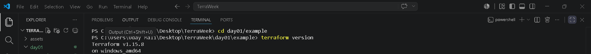
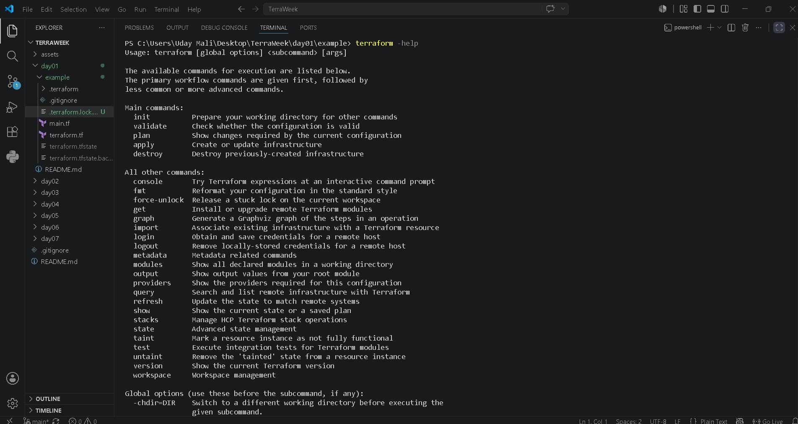
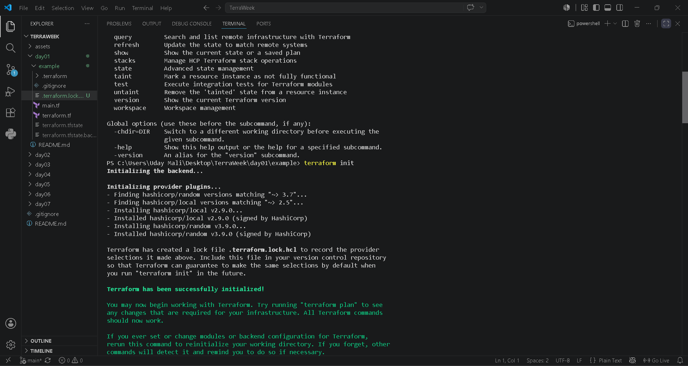
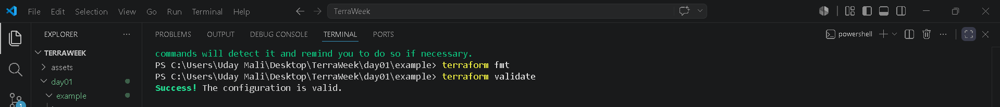
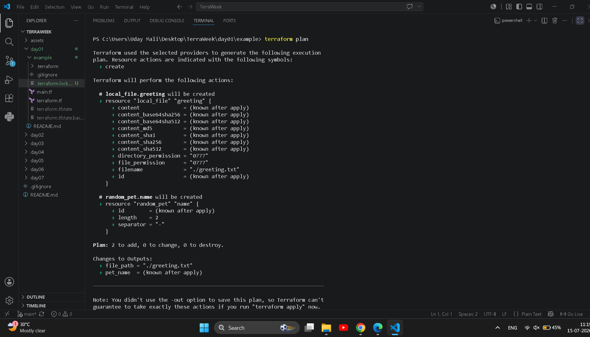
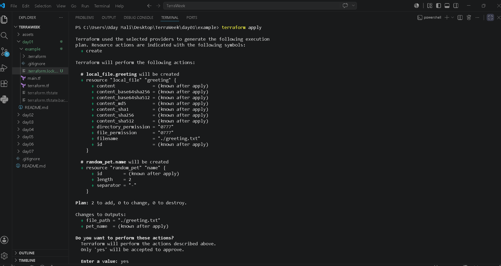
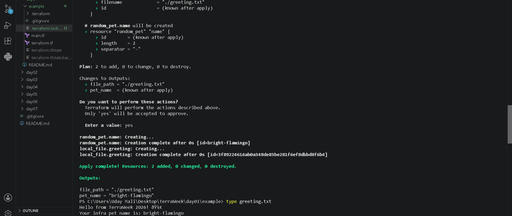
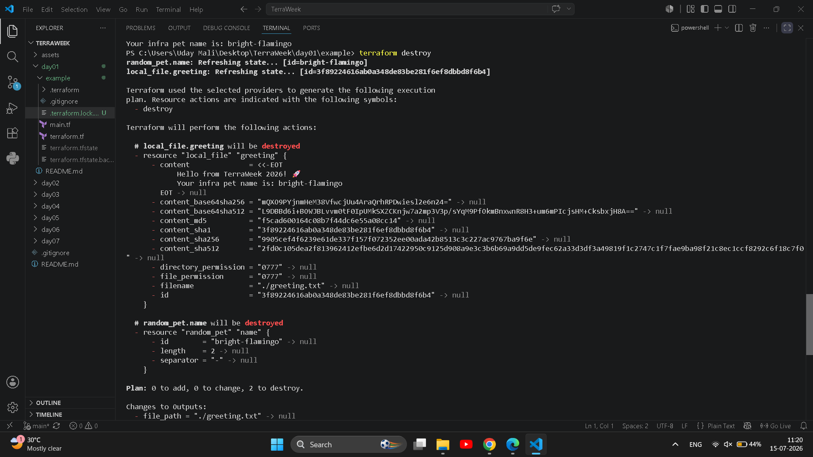

# 🌱 TerraWeek Day 1 — Introduction to IaC & Terraform Basics

**Date:** 15 July 2026

Welcome to **Day 1** of the TerraWeek Challenge!

Today's goal was to understand the fundamentals of **Infrastructure as Code (IaC)**, learn why Terraform is widely used, install Terraform, understand the core workflow, and execute my very first Terraform configuration.

---

# 🎯 Learning Goals

By the end of Day 1, I was able to:

- Understand Infrastructure as Code (IaC)
- Learn why Terraform is used
- Install Terraform CLI
- Configure Visual Studio Code for Terraform
- Understand Terraform workflow
- Learn important Terraform terminologies
- Execute Terraform locally
- Create and destroy resources successfully

---

# 📝 Task 1 — Understanding IaC & Terraform

## What is Infrastructure as Code (IaC)?

Infrastructure as Code (IaC) is the process of managing infrastructure using code instead of manually creating resources through a cloud console.

### Benefits

- Automation
- Version Control
- Repeatability
- Faster Deployments
- Reduced Human Errors

---

## What is Terraform?

Terraform is an open-source Infrastructure as Code tool developed by HashiCorp.

It allows us to create, update and destroy infrastructure using simple configuration files.

### Why Terraform?

- Open Source
- Multi Cloud Support
- Declarative Language
- Easy to Learn
- Huge Provider Ecosystem

---

## Terraform vs Other Tools

| Tool | Description |
|------|-------------|
| Terraform | Multi-cloud Infrastructure as Code tool |
| OpenTofu | Open-source fork of Terraform |
| AWS CloudFormation | AWS-only Infrastructure as Code service |
| Pulumi | Infrastructure using programming languages |
| Ansible | Configuration Management & Automation |

---

# 📝 Task 2 — Install Terraform

Successfully completed:

- Installed Terraform
- Installed VS Code Terraform Extension
- Verified Terraform Version
- Verified Terraform Help Command

## Screenshots

### Terraform Version



---

### Terraform Help



---

# 📝 Task 3 — Learn 6 Crucial Terraform Terminologies

## 1. Provider

A Provider is a plugin that allows Terraform to communicate with platforms like AWS, Azure, Docker, Kubernetes, etc.

**Example:** AWS Provider

---

## 2. Resource

A Resource is any infrastructure object managed by Terraform.

**Example:** AWS S3 Bucket, EC2 Instance

---

## 3. State

Terraform stores information about created resources inside the **terraform.tfstate** file.

---

## 4. Plan

The `terraform plan` command shows what changes Terraform will make before creating resources.

---

## 5. HCL

HCL (HashiCorp Configuration Language) is the language used to write Terraform code.

---

## 6. Module

A Module is a reusable collection of Terraform configuration files.

---

# 📝 Task 4 — First Terraform Configuration

Today I successfully executed my first Terraform workflow.

### Commands Executed

```bash
terraform init
terraform fmt
terraform validate
terraform plan
terraform apply
type greeting.txt
terraform destroy
```

---

## Terraform Init



---

## Terraform Format & Validate



---

## Terraform Plan



---

## Terraform Apply



---

## Generated Greeting File



---

## Terraform Destroy



---

# 📚 Terraform Workflow

The basic Terraform workflow followed during this challenge:

```
Write Code
    │
    ▼
terraform init
    │
    ▼
terraform fmt
    │
    ▼
terraform validate
    │
    ▼
terraform plan
    │
    ▼
terraform apply
    │
    ▼
Verify Output
    │
    ▼
terraform destroy
```

---

# 🎯 Key Learnings

Today I learned:

- Infrastructure as Code (IaC)
- Terraform Basics
- Terraform CLI Commands
- Terraform Workflow
- Terraform Providers
- Resources
- State File
- HCL Language
- Modules
- Local Providers
- Random Provider
- Local File Provider

---

# 🚀 Skills Gained

- Terraform
- Infrastructure as Code (IaC)
- HCL
- DevOps Fundamentals
- VS Code
- Git & GitHub

---

# 📌 Summary

Day 1 helped me understand the fundamentals of Terraform and Infrastructure as Code.

I successfully installed Terraform, explored important concepts, executed the Terraform workflow, created my first resources locally, verified the outputs, and cleaned up the resources using `terraform destroy`.

This marks the beginning of my 7-Day Terraform learning journey.

---

## 🔗 Repository

GitHub Repository:

[TerraWeek GitHub Repository](https://github.com/Maliuday/TerraWeek)

---

⭐ Thank you for reading!

Happy Learning 🚀

#Terraform #TerraformChallenge #InfrastructureAsCode #IaC #DevOps #AWS #CloudComputing #GitHub #TrainWithShubham #TerraWeekChallenge