# 🌱 TerraWeek - Day 2 | HCL Deep Dive with Variables, Locals & Outputs

**📅 Date:** 13 July 2026


---

# 📌 Overview

Day 2 focused on understanding **Terraform HCL (HashiCorp Configuration Language)** and building reusable Terraform configurations using:

- Variables
- Local Values
- Outputs
- Terraform Console
- Docker Provider
- Docker Resources
- Terraform State
- Apply & Destroy Workflow

The project provisions an **NGINX Docker container** using Terraform while keeping the infrastructure modular, reusable and easy to maintain.

---

# 🎯 Learning Objectives

✅ Understand Terraform Variables

✅ Create reusable Terraform code

✅ Use Local Values

✅ Generate Outputs

✅ Execute Terraform Console

✅ Deploy Docker Container

✅ Destroy Infrastructure Safely

---

# 🛠 Technologies Used

- Terraform
- Docker
- HCL
- NGINX
- Windows PowerShell
- Visual Studio Code

---

# 📂 Project Structure

```text
day02
│
├── example
│   ├── main.tf
│   ├── variables.tf
│   ├── outputs.tf
│   ├── terraform.tfvars.example
│   ├── terraform.tfstate
│   └── README.md
│
├── images
│   ├── 01-terraform-init.png
│   ├── 02-03-terraform-ftm-validate.png
│   ├── 04-terraform-apply-plan.png
│   ├── 05-terraform-apply-success.png
│   ├── 06-nginx-browser.png
│   ├── 07-terraform-output.png
│   ├── 08-terraform-console.png
│   ├── 09-docker-ps.png
│   ├── 10-docker-images.png
│   ├── 11-folder-structure.png
│   ├── 12-terraform-destroy.png
│   └── 13-terraform-destroy-success.png
│
├── day02.md
└── README.md
```

---

# 🚀 Terraform Workflow

```bash
terraform init
terraform fmt
terraform validate
terraform plan
terraform apply
terraform output
terraform console
terraform destroy
```

---

# 📸 Execution Screenshots

## 1️⃣ Terraform Initialization

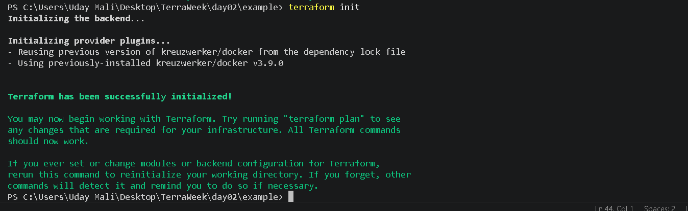

---

## 2️⃣ Terraform Formatting & Validation

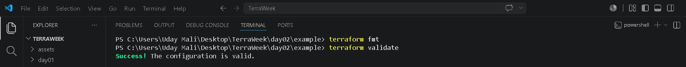

---

## 3️⃣ Terraform Plan

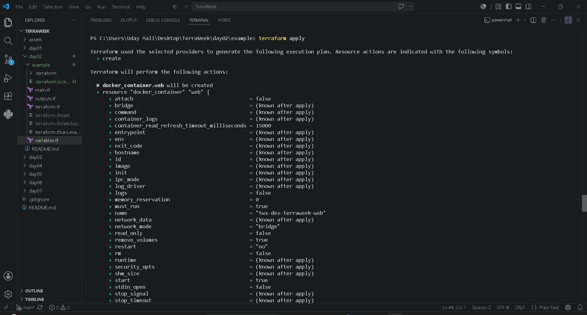

---

## 4️⃣ Terraform Apply

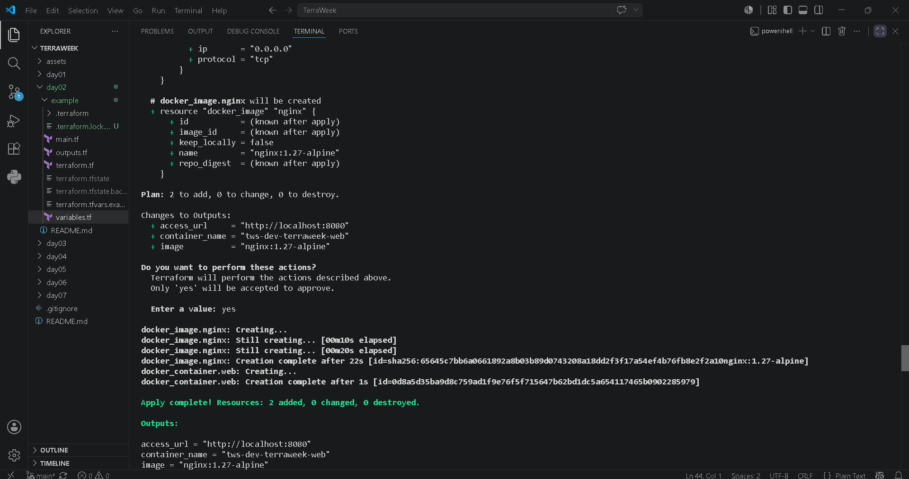

---

## 5️⃣ NGINX Running Successfully

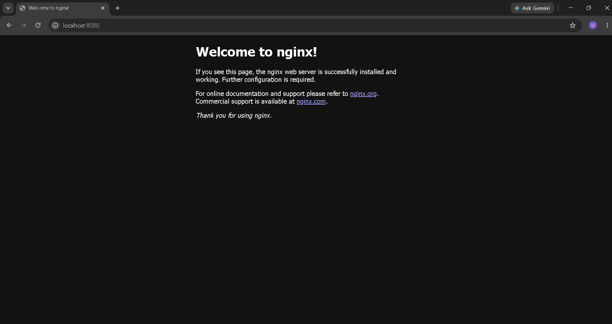

---

## 6️⃣ Terraform Outputs

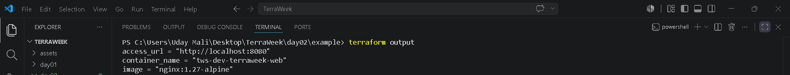

---

## 7️⃣ Terraform Console Functions

Functions Tested:

- upper()
- lower()
- title()
- merge()
- join()
- length()
- format()

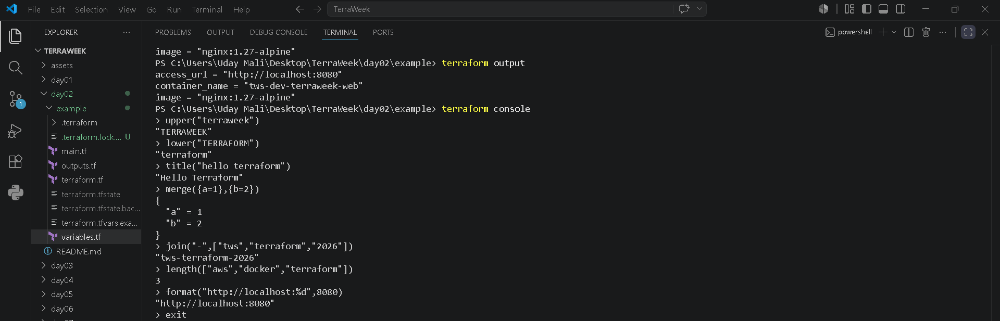

---

## 8️⃣ Docker Verification

Verified:

- Docker Version
- Running Containers
- Docker Images

### Docker Version & Running Containers

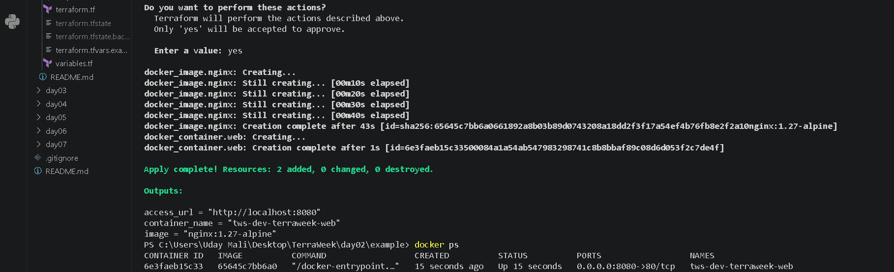

### Docker Images

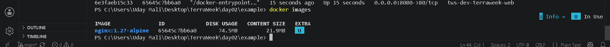

---

## 9️⃣ Project Folder Structure

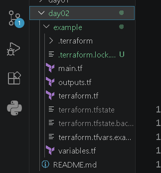

---

## 🔟 Infrastructure Cleanup

### Terraform Destroy

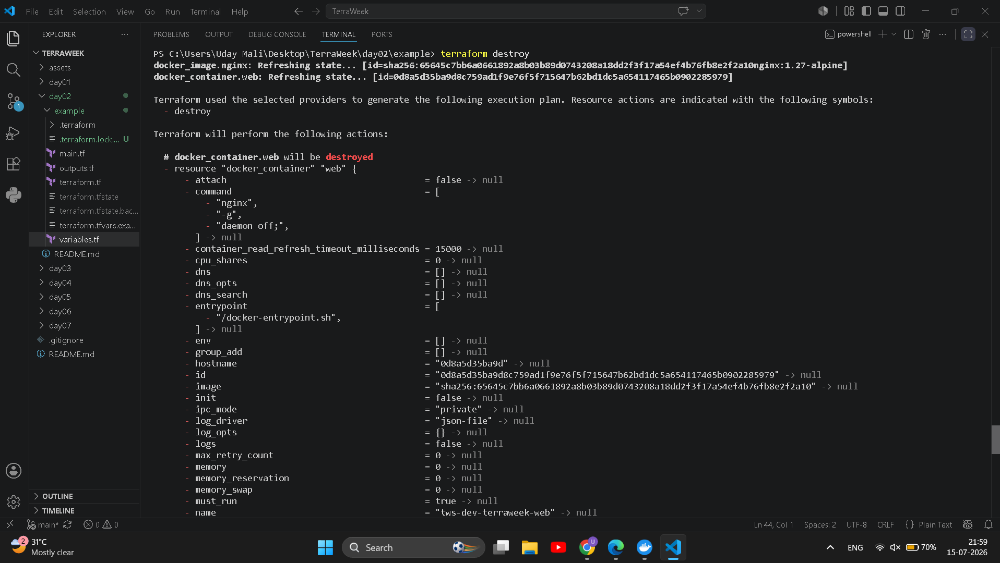

### Destroy Completed Successfully

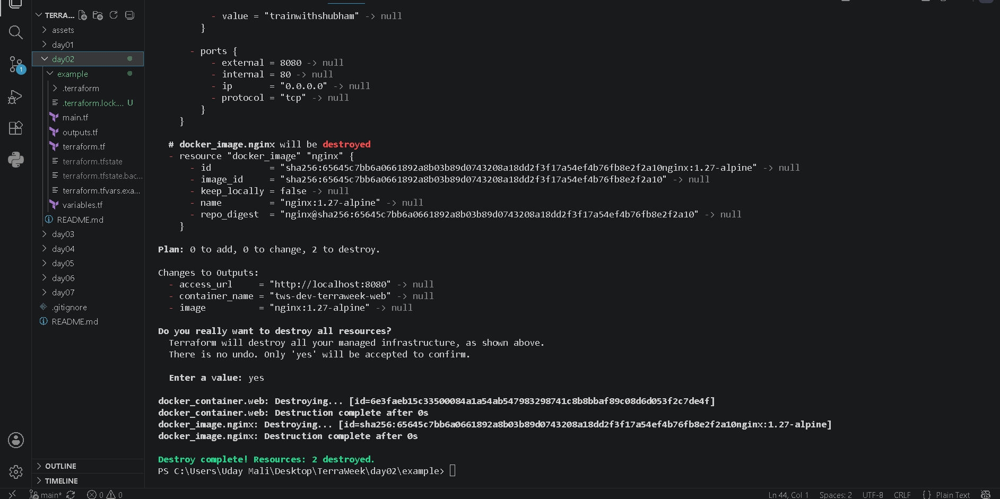

---

# 📤 Outputs

Terraform generated the following outputs:

```text
access_url = http://localhost:8080

container_name = tws-dev-terraweek-web

image = nginx:1.27-alpine
```

---

# 📚 Concepts Learned

- Variables
- Local Values
- Outputs
- Docker Provider
- Docker Resources
- Terraform Console
- Terraform State
- Resource Lifecycle
- Infrastructure as Code (IaC)

---

# ✅ Result

Successfully provisioned an **NGINX Docker container** using Terraform.

Verified:

- Terraform Initialization
- Formatting & Validation
- Execution Plan
- Infrastructure Apply
- Terraform Outputs
- Terraform Console Functions
- Docker Integration
- Infrastructure Cleanup

---

# 🚀 Skills Gained

- Terraform
- Infrastructure as Code (IaC)
- Docker
- HCL
- DevOps Fundamentals
- Infrastructure Automation

---

# 📌 Summary

Day 2 strengthened my understanding of writing reusable Infrastructure as Code using Terraform. I explored Variables, Local Values, Outputs, Terraform Console, and Docker Provider while provisioning an NGINX container. Finally, I verified the deployment and cleaned up all resources successfully using Terraform.

---

## 🔗 Repository

GitHub Repository:

**https://github.com/Maliuday/TerraWeek**

---

# 👨‍💻 Author

**Uday Mali**

Learning Terraform & DevOps through the TerraWeek Challenge 🚀

---

⭐ Thank you for reading!

Happy Learning 🚀

#Terraform #TerraformChallenge #InfrastructureAsCode #IaC #Docker #NGINX #DevOps #AWS #CloudComputing #GitHub #TrainWithShubham #TerraWeekChallenge
