# ☁️ TerraWeek Day 03 — Build AWS Infrastructure with Terraform

**📅 Date:** 14 July 2026

# 📌 Overview

On Day 03 of the TerraWeek Challenge, I built and automated AWS infrastructure using **Terraform**, following the principles of **Infrastructure as Code (IaC)**.

Instead of manually creating cloud resources through the AWS Console, Terraform was used to provision the complete infrastructure with reusable and version-controlled configuration files.

During this challenge, I successfully created:

- ✅ Custom VPC
- ✅ Public Subnet
- ✅ Internet Gateway
- ✅ Route Table & Route Association
- ✅ Security Group
- ✅ Amazon Linux 2023 EC2 Instances
- ✅ Automated Nginx Installation using User Data
- ✅ Terraform Outputs
- ✅ Terraform State Management
- ✅ Infrastructure Cleanup using Terraform Destroy

This project helped me understand how Terraform automates cloud infrastructure deployment while keeping the infrastructure consistent, repeatable, and easy to manage.

---

# 📑 Table of Contents

- Overview
- Learning Objectives
- Prerequisites
- Technologies Used
- Project Structure
- Infrastructure Architecture
- Terraform Configuration
- Terraform Workflow
- Browser Verification
- AWS Console Verification
- Challenges Faced
- Key Learnings
- Conclusion
---

# 🎯 Learning Objectives

By completing this project, I aimed to:

- Understand Infrastructure as Code (IaC) concepts.
- Learn how Terraform communicates with AWS using providers.
- Create AWS resources using Terraform.
- Understand Terraform Resources and Data Sources.
- Configure reusable Terraform variables.
- Provision EC2 instances automatically.
- Deploy a web server using User Data.
- Manage infrastructure using Terraform State.
- Verify deployed resources using the AWS Management Console.
- Safely destroy infrastructure to avoid unnecessary AWS charges.

---

# 🛠️ Technologies Used

| Technology | Purpose |
|------------|---------|
| Terraform | Infrastructure as Code (IaC) |
| AWS | Cloud Platform |
| Amazon EC2 | Virtual Machine |
| Amazon VPC | Private Network |
| Internet Gateway | Internet Connectivity |
| Route Table | Traffic Routing |
| Security Group | Firewall Rules |
| Amazon Linux 2023 | Operating System |
| Nginx | Web Server |
| VS Code | Code Editor |
| AWS CLI | Authentication |
| Git & GitHub | Version Control |

---

# 📋 Prerequisites

Before running this project, ensure you have the following installed and configured:

- Terraform v1.13 or later
- AWS CLI
- AWS Free Tier Account
- IAM User with Programmatic Access
- Git
- Visual Studio Code

---

# 📂 Project Structure

```text
day03/
│
├── example/
│   ├── .terraform/
│   ├── .terraform.lock.hcl
│   ├── terraform.tf
│   ├── variables.tf
│   ├── main.tf
│   ├── outputs.tf
│   ├── terraform.tfstate
│   └── terraform.tfstate.backup
│
├── assets/
│   └── day03/
│
└── day03.md
```

---

# 🏗️ Infrastructure Architecture

The following AWS resources were provisioned automatically using Terraform.

```text
                    Internet
                        │
                Internet Gateway
                        │
                 Route Table
                        │
                 Public Subnet
                        │
                 Security Group
                        │
          ┌─────────────┴─────────────┐
          │                           │
     EC2 Instance-1              EC2 Instance-2
   (Amazon Linux 2023)      (Amazon Linux 2023)
          │                           │
          └────────── Nginx Web Server ──────────┘
```

---

# ☁️ Infrastructure Summary

| Resource | Status |
|----------|--------|
| Custom VPC | ✅ Created |
| Public Subnet | ✅ Created |
| Internet Gateway | ✅ Created |
| Route Table | ✅ Created |
| Route Table Association | ✅ Created |
| Security Group | ✅ Created |
| EC2 Instances | ✅ 2 Created |
| Nginx Web Server | ✅ Installed Automatically |
| Public IP | ✅ Assigned |
| Browser Verification | ✅ Successful |

---
# ⚙️ Terraform Configuration

This project was developed using Terraform configuration files that define the AWS infrastructure as code. Each file has a specific responsibility, making the project clean, modular, and easy to maintain.

---

## 📄 Provider Configuration

The AWS Provider is responsible for connecting Terraform with the AWS Cloud.

It defines:

- Required Terraform Version
- AWS Provider Version
- Deployment Region

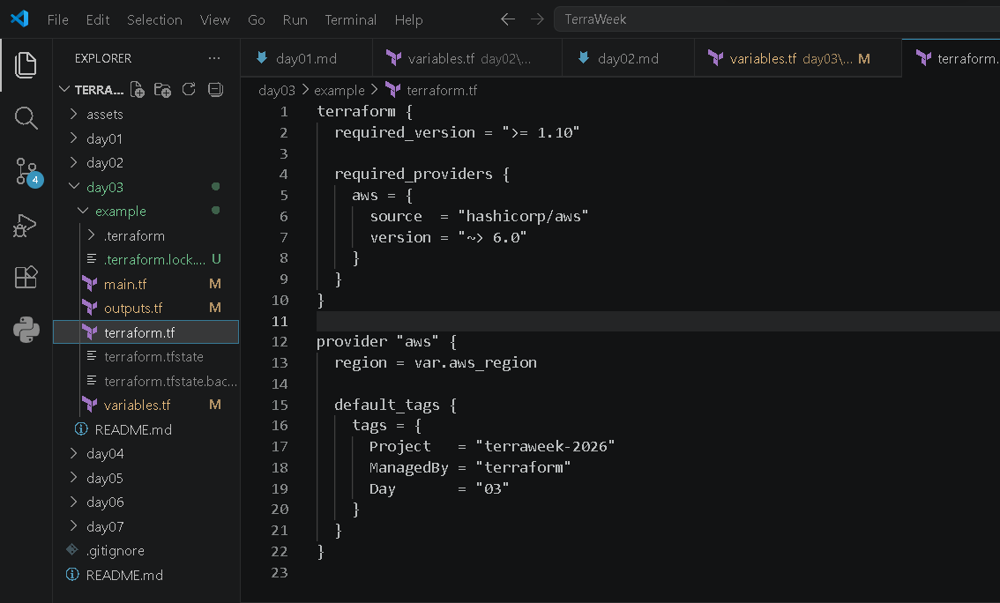

---

## 📄 Variables

Terraform Variables make the infrastructure reusable and configurable without changing the source code.

The following variables were used in this project:

- VPC CIDR
- Public Subnet CIDR
- Instance Type
- AWS Region
- Name Prefix

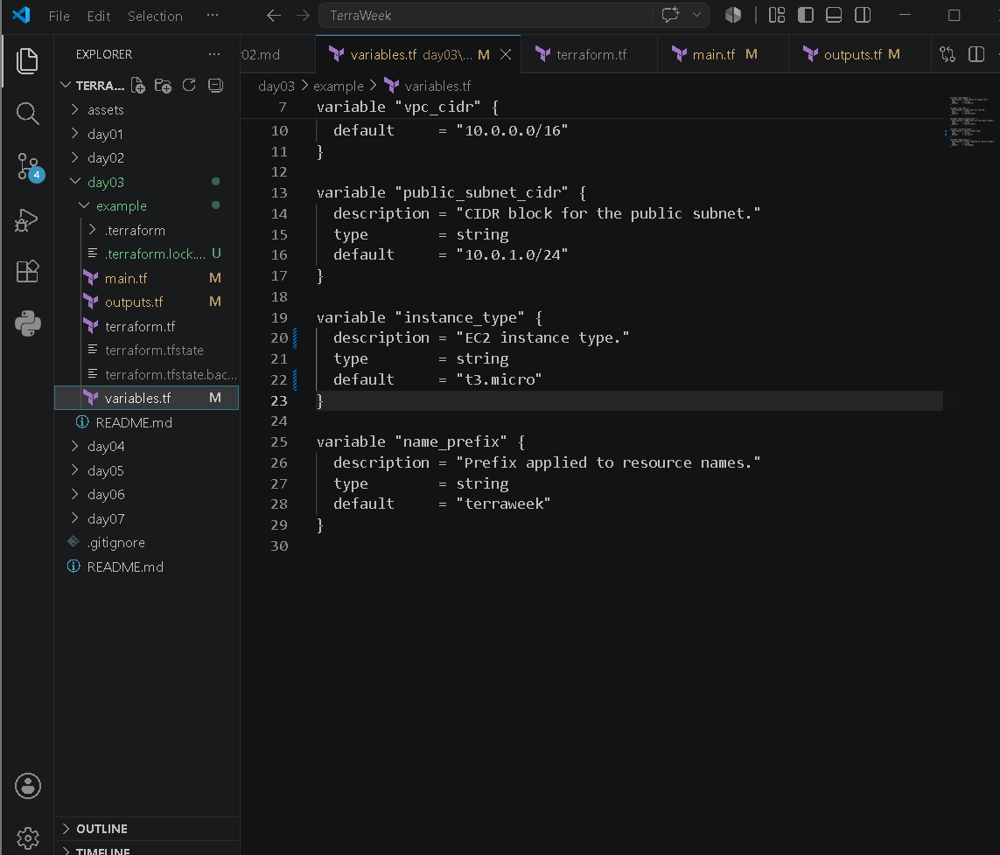

---

## 🔒 Security Group Configuration

A Security Group acts as a virtual firewall that controls inbound and outbound traffic for the EC2 instances.

Configured Rules:

| Type | Port | Source |
|------|------|--------|
| HTTP | 80 | 0.0.0.0/0 |
| Outbound | All | Anywhere |

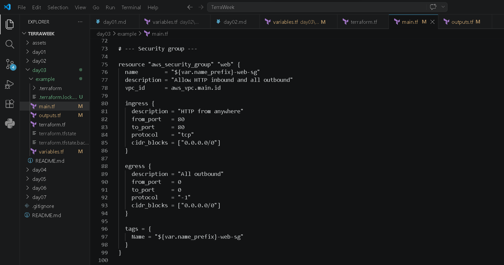

---

## 🖥️ EC2 Instance Configuration

Amazon Linux 2023 EC2 instances were provisioned using Terraform.

Key Features:

- Amazon Linux 2023 AMI
- Free Tier Eligible Instance (t3.micro)
- User Data Script
- Automatic Nginx Installation
- Lifecycle Configuration
- Count Meta Argument

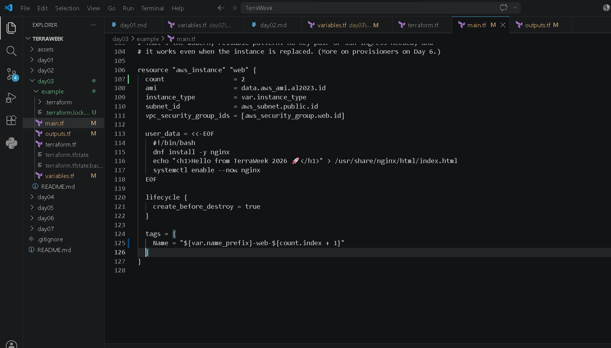

---

## 📤 Outputs

Terraform Outputs provide useful information after infrastructure deployment.

The following outputs were configured:

- Instance IDs
- Public IP Addresses
- Web URLs
- AMI ID

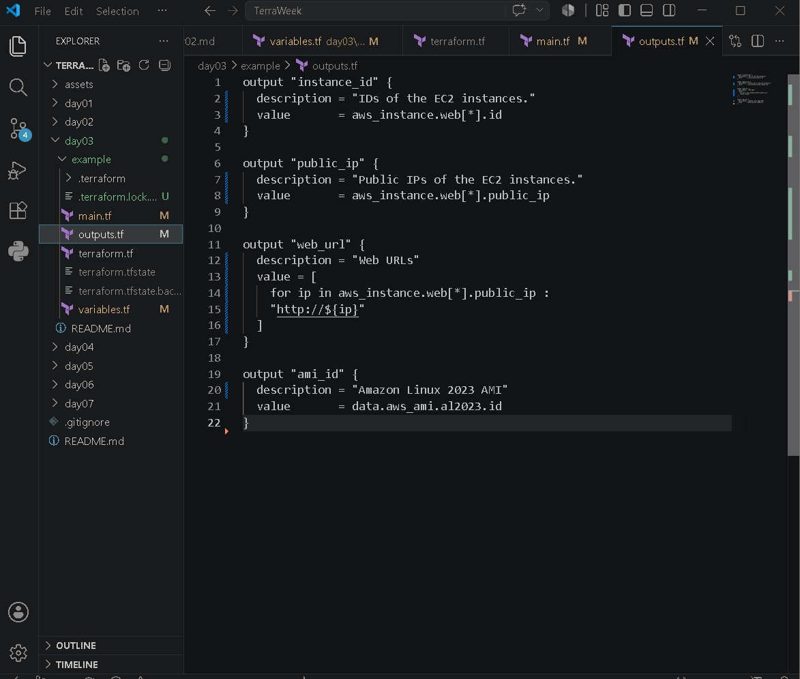

---

# 🚀 Terraform Workflow

The following Terraform workflow was followed throughout this project.

```text
Write Terraform Code
          │
          ▼
terraform fmt
          │
          ▼
terraform init
          │
          ▼
terraform validate
          │
          ▼
terraform plan
          │
          ▼
terraform apply
          │
          ▼
terraform output
          │
          ▼
terraform state list
          │
          ▼
Verify on AWS Console
          │
          ▼
terraform destroy
```

This workflow ensures that infrastructure is validated, planned, deployed, verified, and finally destroyed to prevent unnecessary cloud costs.

---
# 🚀 Terraform Execution

After writing the Terraform configuration files, I executed the following workflow to provision the AWS infrastructure.

---

## Step 1️⃣ — Terraform Initialization

Terraform downloads the required AWS provider plugins and prepares the working directory.

```bash
terraform init
```

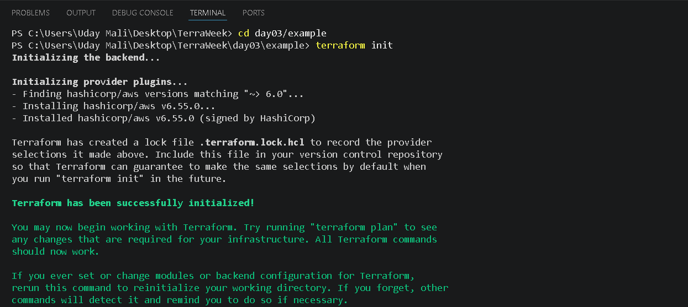

**Result**

- AWS Provider downloaded
- Terraform initialized successfully
- Working directory ready for deployment

---

## Step 2️⃣ — Validate Configuration

Terraform validates the configuration files before deployment.

```bash
terraform validate
```


**Result**

- Configuration syntax verified
- No validation errors found
- Infrastructure ready for planning

---

## Step 3️⃣ — Execution Plan

Terraform generates an execution plan that shows which resources will be created before applying changes.

```bash
terraform plan
```

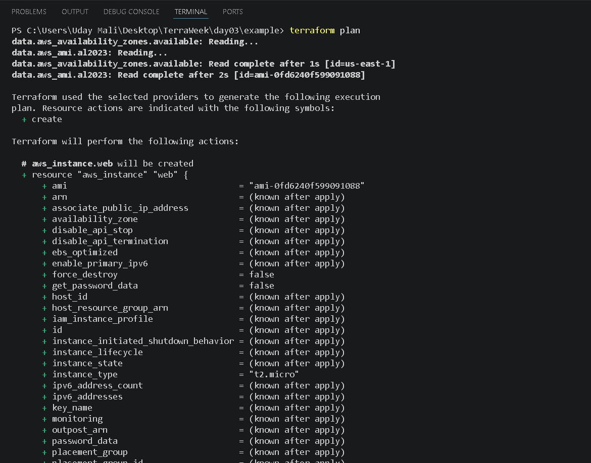

Terraform planned the creation of:

- Custom VPC
- Public Subnet
- Internet Gateway
- Route Table
- Route Table Association
- Security Group
- EC2 Instances

This step helps review infrastructure changes before deployment.

---

## Step 4️⃣ — Apply Infrastructure

Terraform created the complete AWS infrastructure after approval.

```bash
terraform apply
```

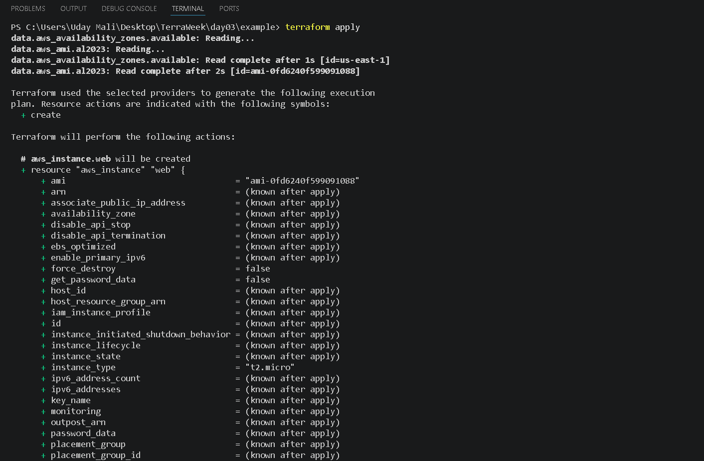

**Resources Created**

- Amazon VPC
- Public Subnet
- Internet Gateway
- Route Table
- Security Group
- Amazon Linux EC2 Instances
- Public IP Addresses

Deployment completed successfully without manual intervention.

---

## Step 5️⃣ — Terraform Outputs

Terraform outputs provide important information after deployment.

```bash
terraform output
```

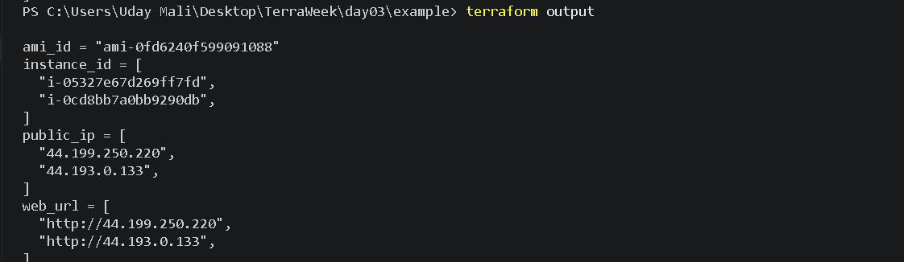

Outputs included:

- Instance IDs
- Public IP Addresses
- Web URLs
- Amazon Linux AMI ID

These outputs make it easy to access deployed resources.

---

## Step 6️⃣ — Terraform State

Terraform stores infrastructure information inside the Terraform State file.

```bash
terraform state list
```

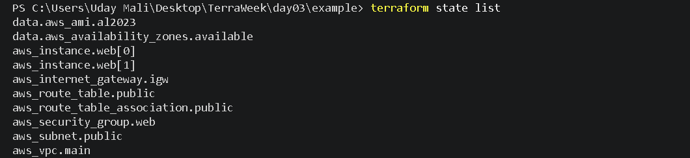

The state file keeps track of every AWS resource managed by Terraform and enables future updates without recreating existing infrastructure.

---
# 🌐 Infrastructure Verification

After Terraform successfully provisioned the AWS infrastructure, I verified all resources from both the browser and the AWS Management Console.

---

# 🌍 Browser Verification

The EC2 instances automatically installed **Nginx** using the **User Data** script during boot.

After deployment, I accessed the application using the EC2 Public IP address.

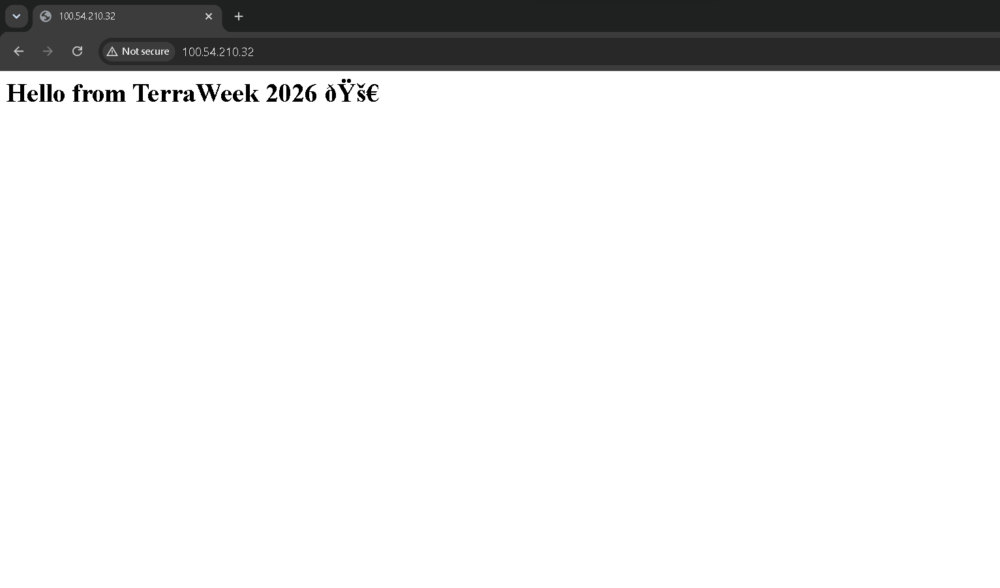

The successful browser response confirmed that:

- ✅ EC2 Instance is running
- ✅ User Data executed successfully
- ✅ Nginx installed automatically
- ✅ Security Group allows HTTP traffic
- ✅ Internet Gateway and Route Table are working correctly

---

# ☁️ AWS Console Verification

Terraform created all AWS resources successfully.

---

## 🖥️ EC2 Instances

The EC2 instances were successfully launched using the latest Amazon Linux 2023 AMI.

Features:

- Amazon Linux 2023
- Public IP Enabled
- t3.micro Instance Type
- Automatically Installed Nginx

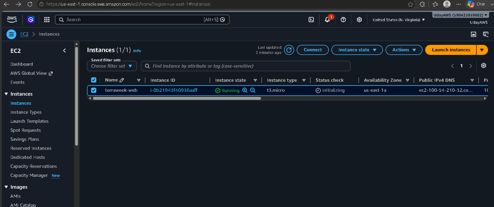

---

## 🌐 Virtual Private Cloud (VPC)

A dedicated Virtual Private Cloud (VPC) was created to isolate the infrastructure.

The VPC acts as the private network where all AWS resources are deployed securely.

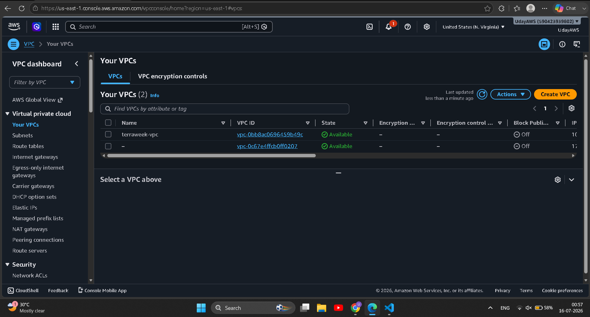

---

## 📡 Public Subnet

A Public Subnet was created inside the VPC.

This subnet allows resources to communicate with the internet through the Internet Gateway.

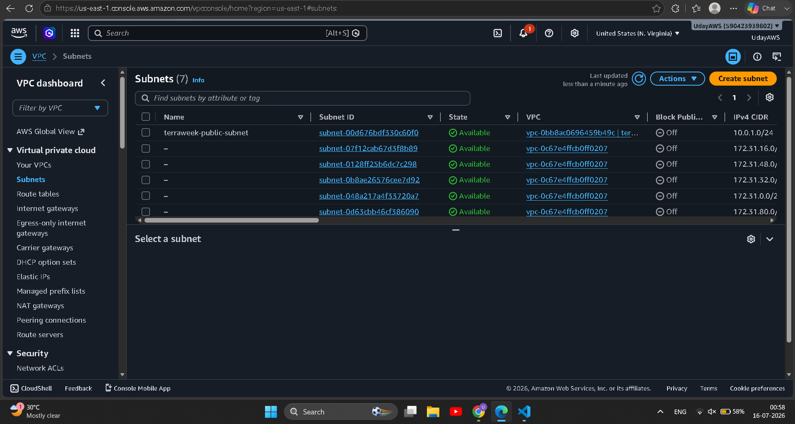

---

## 🌍 Internet Gateway

The Internet Gateway provides internet connectivity to resources inside the VPC.

Without the Internet Gateway, the EC2 instance would not be accessible from the browser.

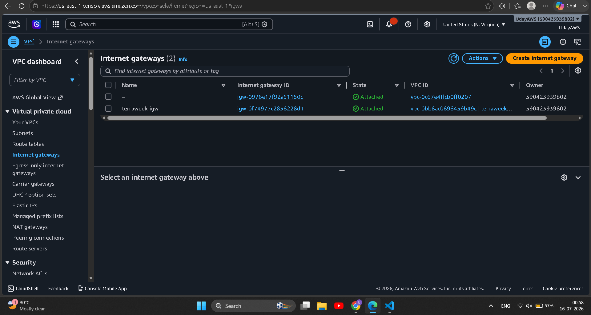

---

## 🛣️ Route Table

The Route Table defines how network traffic is routed.

A default route (`0.0.0.0/0`) forwards internet traffic through the Internet Gateway.

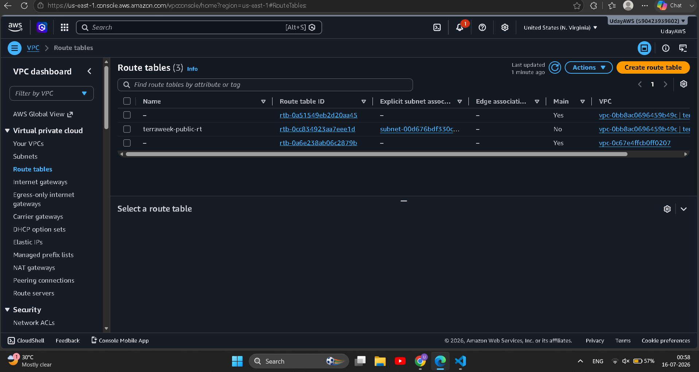

---

## 🔐 Security Group

The Security Group acts as a virtual firewall for the EC2 instances.

Configured Rules:

| Protocol | Port | Purpose |
|----------|------|---------|
| HTTP | 80 | Browser Access |
| All Outbound | All | Internet Access |

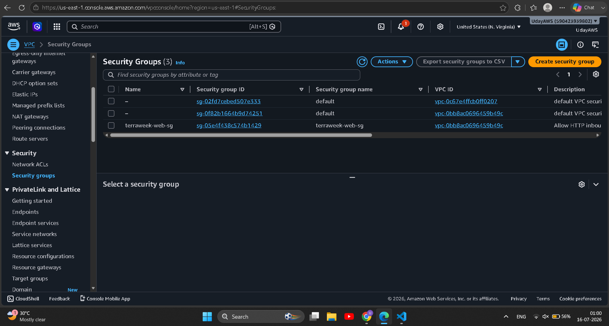

---

# 🏗️ AWS Infrastructure Summary

| Resource | Status |
|-----------|--------|
| VPC | ✅ Created |
| Public Subnet | ✅ Created |
| Internet Gateway | ✅ Attached |
| Route Table | ✅ Configured |
| Security Group | ✅ Configured |
| EC2 Instances | ✅ Running |
| Nginx Web Server | ✅ Installed |
| Public IP | ✅ Assigned |
| Browser Verification | ✅ Successful |

---

# 💡 Key Observation

One of the best things I learned during this project was seeing how multiple AWS resources work together.

Terraform automatically created each resource in the correct order by understanding their dependencies.

Instead of manually creating networking components one by one, the complete infrastructure was provisioned using a single Terraform workflow.

This demonstrates the real power of **Infrastructure as Code (IaC)**.

---
# 🧹 Infrastructure Cleanup

Once the deployment was verified successfully, all AWS resources were destroyed using Terraform to avoid unnecessary cloud charges.

```bash
terraform destroy
```

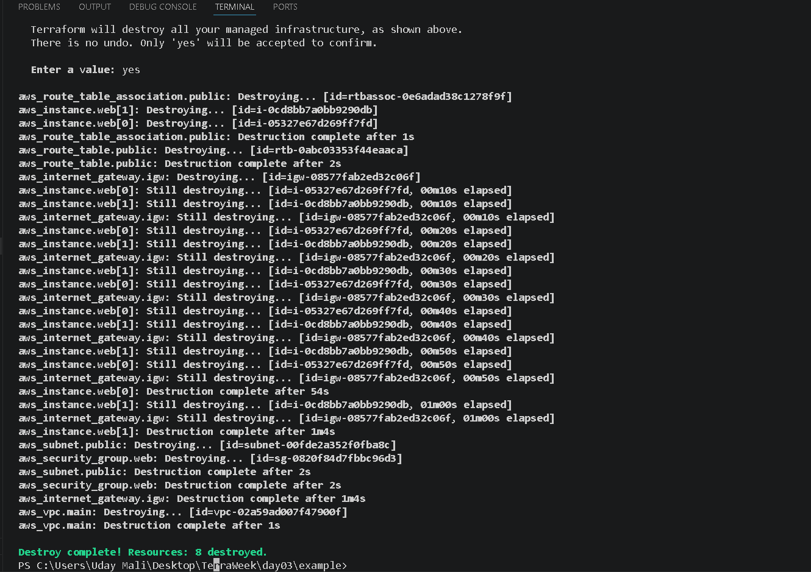

Terraform removed all managed resources in the correct dependency order, ensuring a clean and cost-effective environment.

---

# ⚠️ Challenges Faced

During this project, I encountered an issue while provisioning the EC2 instance.

### Issue

Terraform returned an error because the selected instance type was not eligible for the AWS Free Tier in my region.

**Error**

- `The specified instance type is not eligible for Free Tier`

### Resolution

I updated the EC2 instance type from:

```text
t2.micro
```

to

```text
t3.micro
```

After updating the configuration, Terraform successfully created the infrastructure without any errors.

This troubleshooting experience helped me better understand AWS region compatibility and Free Tier limitations.

---

# 📚 Key Learnings

Throughout Day 03, I gained practical experience in:

- Infrastructure as Code (IaC)
- Terraform Providers
- AWS Provider Configuration
- Version Pinning
- Variables & Outputs
- Resources vs Data Sources
- Terraform Lifecycle
- EC2 Provisioning
- VPC Networking
- Public Subnet Configuration
- Internet Gateway
- Route Table & Association
- Security Groups
- User Data Automation
- Terraform State Management
- Infrastructure Verification
- Infrastructure Cleanup

---

# 🚀 Skills Gained

- Terraform
- AWS
- Amazon EC2
- Amazon VPC
- Infrastructure as Code (IaC)
- Cloud Networking
- DevOps Fundamentals
- Nginx
- AWS CLI
- Git & GitHub
- VS Code

---

# 📌 Conclusion

Day 03 was an important milestone in my Terraform learning journey.

Instead of manually provisioning infrastructure through the AWS Console, I successfully automated the deployment of a complete AWS environment using Terraform.

This project strengthened my understanding of cloud networking, Infrastructure as Code, resource dependencies, Terraform workflows, and AWS resource provisioning.

It also demonstrated how automation improves consistency, reduces manual effort, and enables repeatable infrastructure deployments.

---

# 📊 Project Outcome

✔ Successfully provisioned AWS infrastructure using Terraform

✔ Created a custom VPC and Public Subnet

✔ Configured Internet Gateway and Route Table

✔ Deployed Amazon Linux EC2 Instances

✔ Installed and verified Nginx using User Data

✔ Validated infrastructure using AWS Console

✔ Managed infrastructure with Terraform State

✔ Destroyed all resources to prevent unnecessary AWS charges

---

# 📂 GitHub Repository

**Repository**

https://github.com/Maliuday/TerraWeek

---

# 👨‍💻 Author

**Uday Mali**

Learning **AWS, Terraform and DevOps** through the **TerraWeek Challenge** while building real-world Infrastructure as Code (IaC) projects.

⭐ Thank you for visiting this repository!

Happy Terraforming! 🚀
