# 🗄️ TerraWeek Day 4 — Terraform State & Remote Backend (Native S3 Locking)

> **Date:** Wednesday, 15th July 2026

Today I explored one of the most important concepts in Terraform—**Terraform State Management**.

In this hands-on lab, I learned how Terraform stores infrastructure information inside the **terraform.tfstate** file, why state is important, how to migrate it from **Local State** to **Remote State**, and how to securely manage it using an **Amazon S3 Backend** with **Native S3 Locking**.

This lab also covered the latest Terraform approach for state locking using **`use_lockfile = true`**, eliminating the need for a DynamoDB table.

---

# 🎯 Learning Objectives

By the end of Day 4, I was able to:

- Understand Terraform State
- Learn why the State File is important
- Explore Local State
- Configure Remote Backend
- Create an S3 Bucket for Remote State
- Enable Bucket Versioning
- Enable Server Side Encryption
- Block Public Access
- Configure Native S3 State Locking
- Migrate Local State to Remote State
- Explore Terraform State Commands
- Understand State Lock Files
- Destroy Infrastructure Safely

---

# ☁️ Technologies Used

- Terraform v1.15.x
- AWS S3
- AWS IAM
- Terraform Backend
- Terraform State
- Remote Backend
- Native S3 Locking
- VS Code
- PowerShell
- Git & GitHub

---

# 📂 Project Structure

```
day04/
│
├── backend_infra/
│   ├── terraform.tf
│   ├── resources.tf
│   ├── variables.tf
│   ├── outputs.tf
│
├── backend_demo/
│   ├── terraform.tf
│   ├── resources.tf
│
├── images/
│   ├── 01-backend-infra-files.png
│   ├── 02-backend-demo-files.png
│   ├── 03-backend-config.png
│   ├── 04-s3-bucket-created.png
│   ├── 05-terraform-state-in-s3.png
│   ├── 06-terraform-init.png
│   ├── 07-terraform-plan.png
│   ├── 08-terraform-apply.png
│   ├── 09-terraform-output.png
│   ├── 10-state-list.png
│   ├── 11-state-show.png
│   ├── 12-terraform-destroy.png
│   └── 13-bucket-empty.png
│
└── README.md
```

---

# 📖 What is Terraform State?

Terraform State is a file that keeps track of all infrastructure resources managed by Terraform.

Whenever Terraform creates, updates, or deletes a resource, it records the latest infrastructure information inside the **terraform.tfstate** file.

Without this file, Terraform would not know which resources already exist and which changes need to be applied.

---

## Why Terraform State is Important

Terraform State helps Terraform:

- Track Infrastructure
- Compare Desired State vs Current State
- Detect Infrastructure Changes
- Generate Execution Plans
- Update Existing Resources
- Destroy Resources Safely

---

## Terraform State File

Terraform stores infrastructure details inside:

```text
terraform.tfstate
```

The state file contains:

- Resource IDs
- Resource Attributes
- Outputs
- Provider Metadata
- Dependencies
- Infrastructure Mapping

> ⚠️ Never edit the `terraform.tfstate` file manually.

---

# ⚠️ Why You Should Never Commit terraform.tfstate

The Terraform State file may contain sensitive information such as:

- Resource IDs
- Public IP Addresses
- Secret Values
- Access Keys
- Database Endpoints
- Passwords

For security reasons, the state file should never be committed to GitHub.

Always include the following entries inside your `.gitignore` file:

```gitignore
*.tfstate
*.tfstate.*
.terraform/
```

---

# 🏠 Local State vs ☁️ Remote State

| Local State | Remote State |
|-------------|--------------|
| Stored on Local Machine | Stored on AWS S3 |
| Suitable for Learning | Suitable for Teams |
| Difficult to Share | Easy Collaboration |
| No State Locking | Native State Locking |
| Higher Risk | More Secure |
| Not Recommended for Production | Production Ready |

---

# 🚀 Backend Infrastructure

The first step was to create an Amazon S3 bucket that will be used to store the Terraform State remotely.

This infrastructure includes:

- Amazon S3 Bucket
- Bucket Versioning
- Server Side Encryption
- Public Access Block
- Output Values

---

# 📸 Backend Infrastructure Files

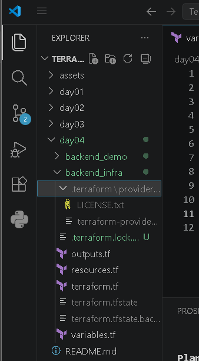

---

# 📸 Backend Demo Files

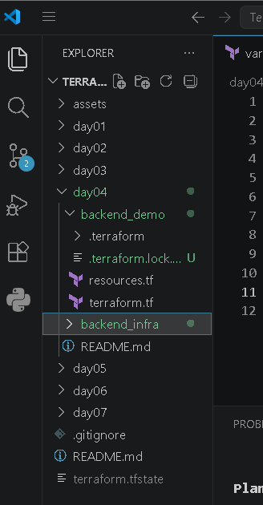

---

# 📸 Backend Configuration

The backend configuration was updated to use the S3 bucket along with Native S3 Locking.

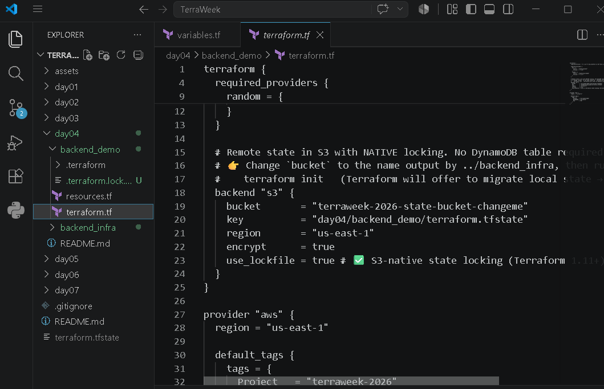

---
# ☁️ Creating the Remote Backend

The backend infrastructure was created using Terraform.

This automatically provisioned an Amazon S3 bucket that will securely store the Terraform State file.

The bucket was configured with:

- Versioning Enabled
- Server Side Encryption (AES256)
- Block Public Access
- Native S3 State Locking Support
- Secure Backend Configuration

---

# 📸 Amazon S3 Bucket Created

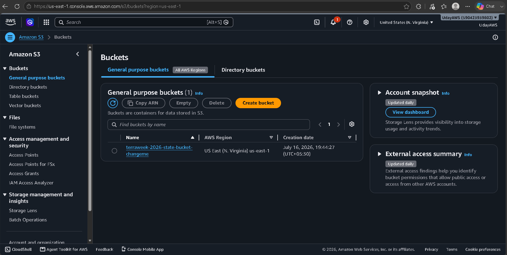

---

# 🔄 Migrating Local State to Remote State

After creating the backend infrastructure, I configured Terraform to use the S3 bucket as a Remote Backend.

Terraform automatically detected the existing local state file and migrated it to Amazon S3.

This allows Terraform to securely manage infrastructure remotely instead of relying on a local state file.

---

# 📸 Terraform State Stored in Amazon S3

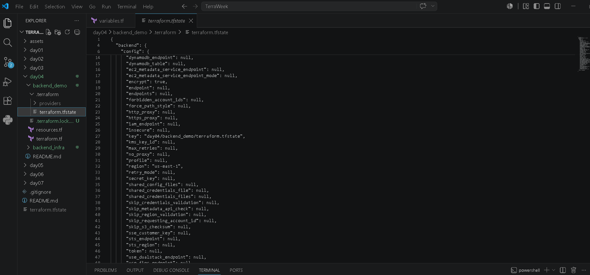

---

# 🚀 Initializing the Backend

Once the backend configuration was completed, I initialized Terraform.

Command used:

```bash
terraform init
```

Terraform successfully:

- Initialized the backend
- Connected to Amazon S3
- Downloaded required providers
- Migrated Local State to Remote State

---

# 📸 Terraform Init

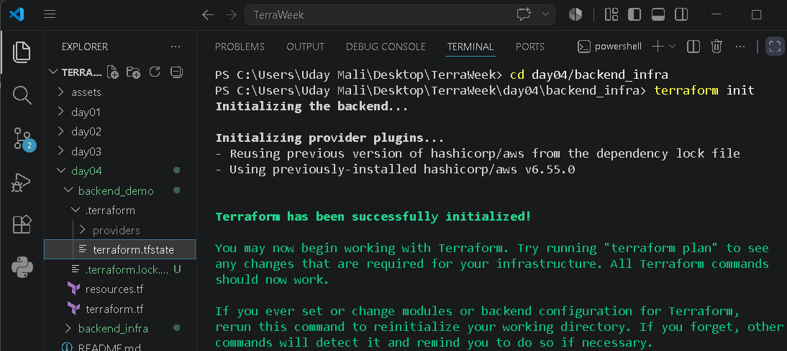

---

# 📋 Reviewing the Execution Plan

Before creating any infrastructure, Terraform generated an execution plan.

Command used:

```bash
terraform plan
```

The execution plan showed:

- Resources to be Created
- Resources to be Modified
- Resources to be Destroyed
- Infrastructure Changes

This step helps verify infrastructure before deployment.

---

# 📸 Terraform Plan

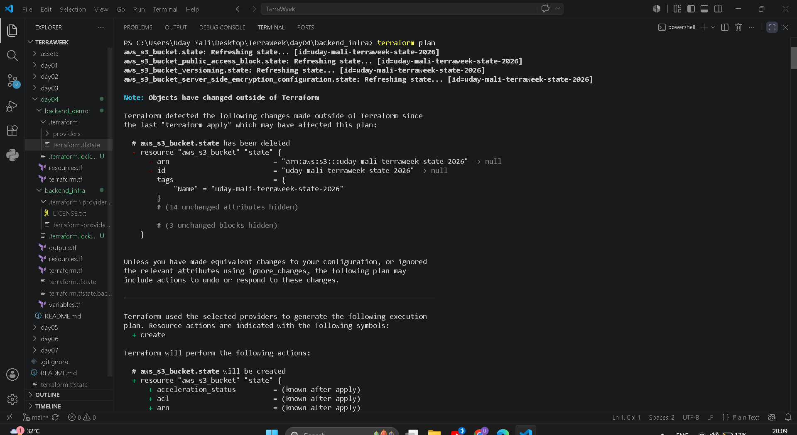

---

# ⚡ Applying the Configuration

After verifying the execution plan, I applied the Terraform configuration.

Command used:

```bash
terraform apply
```

Terraform successfully created the required infrastructure and updated the Remote State stored in Amazon S3.

---

# 📸 Terraform Apply

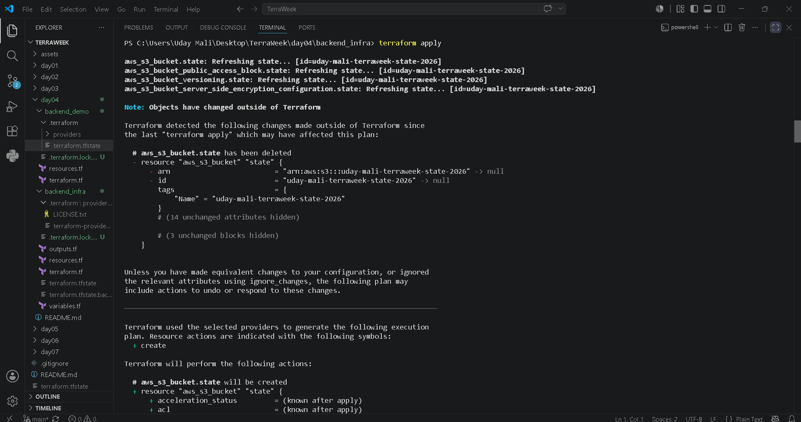

---

# 📤 Viewing Terraform Outputs

Terraform Outputs provide useful information after infrastructure creation.

Command used:

```bash
terraform output
```

The output displayed values generated during deployment, making it easy to reference important infrastructure details.

---

# 📸 Terraform Output

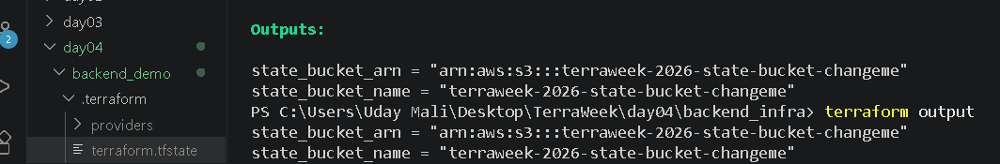

---

# 📦 Remote State Storage

After applying the configuration, Terraform automatically uploaded the following files to Amazon S3:

- terraform.tfstate
- terraform.tfstate.tflock (during execution)

This ensures:

- Secure State Management
- Shared Team Collaboration
- Reliable Infrastructure Tracking
- Native State Locking
- Reduced Risk of State Corruption

---

# 🔐 Native S3 State Locking

Terraform v1.11+ introduced Native S3 Locking using:

```hcl
use_lockfile = true
```

During every Terraform operation:

- A temporary `.tflock` file is created.
- Other Terraform executions are blocked until the current operation completes.
- Once finished, the lock file is automatically removed.

This prevents multiple users from modifying the same infrastructure simultaneously.

---

# 💡 Why Native Locking Matters

Benefits include:

- Prevents Concurrent Changes
- Protects Terraform State
- Avoids State Corruption
- Safe Team Collaboration
- No DynamoDB Required
- Simpler Backend Configuration

---
# 🔎 Exploring Terraform State Commands

Terraform provides several built-in commands to inspect and manage the Terraform State.

During today's lab, I explored some of the most commonly used state commands.

---

## 📋 List All Resources

Command:

```bash
terraform state list
```

This command displays every resource currently managed by Terraform.

### 📸 Terraform State List

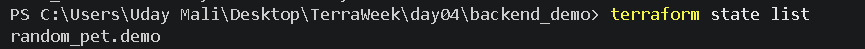

---

## 🔍 Inspect Resource Details

Command:

```bash
terraform state show random_pet.demo
```

This command displays complete information about a specific resource stored inside the Terraform State file.

It helps understand:

- Resource Attributes
- Resource ID
- Current Values
- Provider Information

### 📸 Terraform State Show

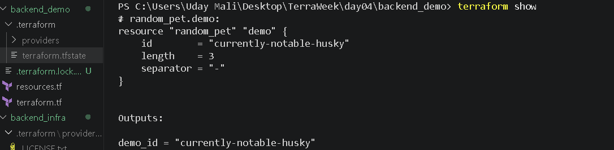

---

# 🧹 Cleaning Up Infrastructure

To avoid unnecessary AWS charges, all created resources were removed after completing the lab.

Command used:

```bash
terraform destroy
```

Terraform safely deleted all managed resources while keeping the infrastructure consistent with the state.

---

## 📸 Terraform Destroy

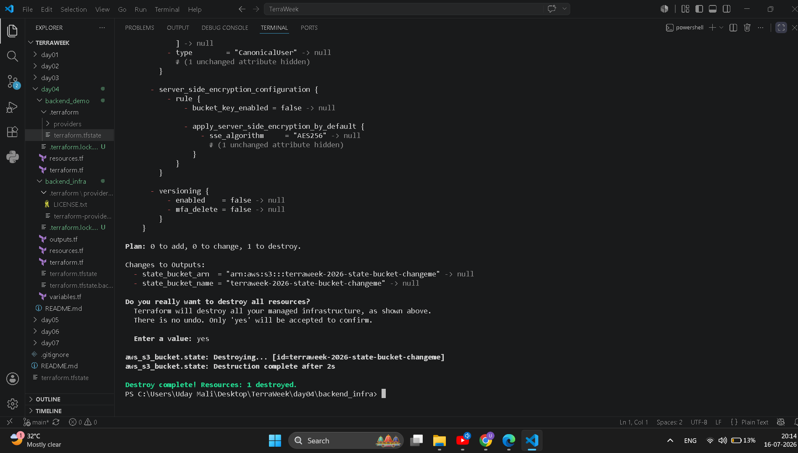

---

# 🪣 Empty S3 Bucket Verification

After destroying the infrastructure, I verified that the S3 bucket was cleaned up successfully.

This ensures that no unnecessary Terraform State files remain inside the bucket.

### 📸 Empty S3 Bucket

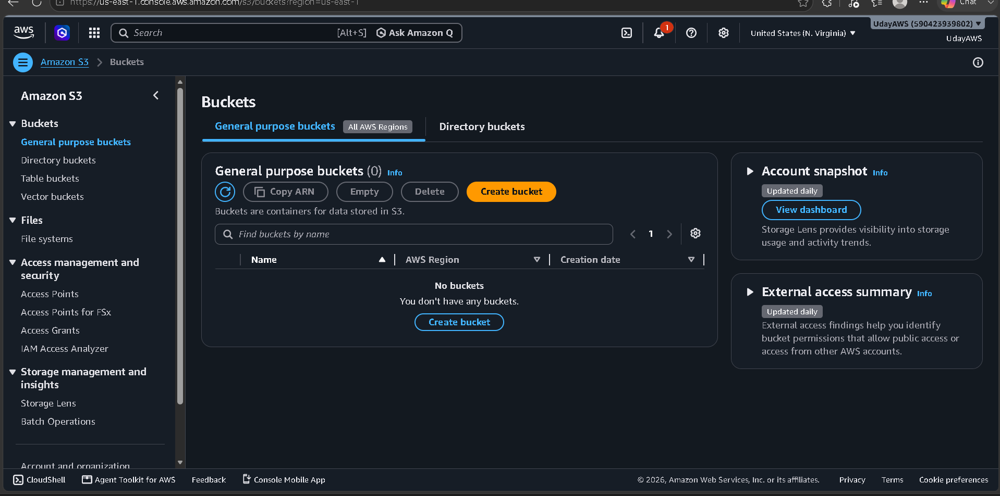

---

# 📚 Commands Practiced

```bash
terraform init

terraform plan

terraform apply

terraform output

terraform state list

terraform state show random_pet.demo

terraform destroy
```

---

# 🎯 Key Learnings

Today I learned:

- Terraform State Fundamentals
- Local State vs Remote State
- Amazon S3 Backend
- Native S3 State Locking
- Backend Configuration
- State Migration
- Bucket Versioning
- Server Side Encryption
- Public Access Block
- Terraform State Commands
- Infrastructure Tracking
- Secure State Management
- Infrastructure Cleanup

---

# 🚀 Skills Gained

- Terraform
- AWS S3
- Remote Backend
- Terraform State
- State Locking
- Infrastructure as Code (IaC)
- AWS Cloud
- DevOps
- Version Control
- GitHub Documentation

---

# 💡 Best Practices Learned

Throughout this challenge, I also learned several Terraform best practices:

- Never commit `terraform.tfstate` to GitHub.
- Always enable Versioning on the backend bucket.
- Enable Server Side Encryption.
- Block Public Access on the state bucket.
- Use Remote State for team collaboration.
- Enable Native S3 Locking using `use_lockfile = true`.
- Always review `terraform plan` before applying changes.
- Destroy resources after completing practical labs to avoid unnecessary cloud costs.

---

# 📖 Summary

Day 4 was one of the most important milestones in my Terraform learning journey.

I learned how Terraform tracks infrastructure using the **terraform.tfstate** file, why the state file is critical, and how Remote State improves collaboration and reliability.

I successfully created an Amazon S3 backend, enabled versioning and encryption, migrated Local State to Remote State, explored Terraform State commands, and implemented Native S3 Locking using the latest Terraform approach.

Finally, I safely cleaned up all resources using **terraform destroy**, following Infrastructure as Code best practices.

This hands-on lab strengthened my understanding of Terraform State Management and prepared me for real-world DevOps workflows where secure and reliable state management is essential.

---

# 📂 Repository

You can explore the complete source code here:

👉 **GitHub Repository**

https://github.com/Maliuday/TerraWeek

---

# 🙌 Connect With Me

If you found this project helpful, feel free to connect with me and check out my other DevOps and Cloud projects.

⭐ Star the repository if you like it!

---

# 📌 What's Next?

➡️ **Day 5 — Terraform Modules**

In the next challenge, I'll learn how to build reusable Terraform Modules to organize Infrastructure as Code efficiently and follow production-ready DevOps practices.

---

## 🚀 Happy Learning!

> **"Infrastructure becomes powerful when it is automated, version-controlled, and reproducible."**

Thank you for reading! 😊

---

### ⭐ If you enjoyed this project, don't forget to give the repository a Star!

#Terraform #TerraformState #RemoteBackend #AWS #AmazonS3 #InfrastructureAsCode #IaC #DevOps #CloudComputing #GitHub #TerraformChallenge #TrainWithShubham #TerraWeekChallenge
