# 📦 TerraWeek Day 5 – Terraform Modules: Reusable & Composable Infrastructure
**Date:** Thursday, 16th July 2026
<div align="center">


### 🚀 TerraWeek Challenge – Day 5

### **Building Reusable Infrastructure using Terraform Modules**

</div>

---

# 📖 Overview

As Terraform projects grow, maintaining a single large configuration file quickly becomes difficult. The best practice is to split infrastructure into reusable **Terraform Modules**, allowing the same code to be shared across multiple environments and projects.

On **Day 5** of the TerraWeek Challenge, I explored one of Terraform's most powerful concepts—**Modules**.

Instead of writing duplicate infrastructure code, I created a reusable EC2 module, consumed it from a root module, deployed multiple EC2 instances using `for_each`, implemented input validation, explored outputs, and learned how Terraform Registry modules are versioned for production-ready infrastructure.

This project demonstrates how DevOps engineers organize Terraform code for scalability, consistency, and long-term maintainability.

---

# 🎯 Objectives

The primary objectives of this lab were to:

- Understand Terraform Modules
- Learn Root Module vs Child Module
- Build a reusable EC2 module
- Pass variables as module inputs
- Export values using outputs
- Implement input validation
- Reuse modules multiple times using `for_each`
- Understand module composition
- Learn Terraform Registry modules
- Understand Git-based modules
- Explore Module Version Pinning
- Follow Infrastructure as Code best practices

---

# 🏗 What I Built

During this lab I successfully created:

- ✅ Reusable EC2 Module
- ✅ Root Module
- ✅ Child Module
- ✅ Input Variables
- ✅ Output Variables
- ✅ Input Validation
- ✅ Local Module Source
- ✅ Module Composition using `for_each`
- ✅ Multiple EC2 Deployments
- ✅ Shared Data Sources
- ✅ Module Documentation
- ✅ Terraform Workflow
- ✅ Infrastructure Cleanup

---

# 🧠 What is a Terraform Module?

A **Terraform Module** is a collection of Terraform configuration files that work together to provision a specific piece of infrastructure.

Instead of duplicating Terraform code, modules allow developers to package infrastructure into reusable components.

Think of a module as a reusable function in programming.

Write once.
Reuse anywhere.

Examples include:

- EC2 Module
- VPC Module
- Security Group Module
- S3 Bucket Module
- RDS Module
- Load Balancer Module

Terraform itself treats every configuration as a module.

The folder where Terraform execution begins is called the **Root Module**, while reusable modules inside separate folders are known as **Child Modules**.

---

# 🌳 Root Module vs Child Module

| Root Module | Child Module |
|-------------|--------------|
| Entry point of Terraform execution | Reusable Terraform component |
| Executes `terraform apply` | Called from Root Module |
| Performs shared lookups | Receives inputs from Root Module |
| Manages workflow | Manages a single resource |
| Reads outputs | Returns outputs |

---

# ⭐ Benefits of Terraform Modules

Using modules provides several advantages:

- ♻️ Code Reusability
- 📦 Modular Infrastructure
- 🔒 Better Security
- 📖 Easier Maintenance
- 🚀 Faster Deployment
- 👥 Team Collaboration
- 🧩 Infrastructure Composition
- 📈 Scalability
- 🔁 Version Control
- ✅ Production Ready Architecture

---

# 📁 Project Structure

```text
day05/
│
├── example/
│   │
│   ├── modules/
│   │   └── ec2_instance/
│   │       ├── main.tf
│   │       ├── variables.tf
│   │       ├── outputs.tf
│   │       └── README.md
│   │
│   ├── main.tf
│   ├── outputs.tf
│   └── terraform.tf
│
└── day05.md
```

---

# 🧩 Module Architecture

```
                Root Module
                     │
                     │
     ┌───────────────┴────────────────┐
     │                                │
Shared Data Sources              Module Calls
(AMI, VPC, Subnet, SG)                 │
     │                                │
     │                          ec2_instance
     │                                │
     │                                │
     ├──────────────┬─────────────────┤
     │              │                 │
 web_server        app            worker
                                  cache
```

The Root Module resolves shared resources only once and passes them as inputs into reusable child modules.

This design avoids duplicate lookups and keeps modules reusable across different AWS accounts, regions, and VPCs.

---

# 📂 Module Files

The reusable EC2 module contains four important files.

| File | Purpose |
|------|----------|
| `main.tf` | Creates EC2 Instance |
| `variables.tf` | Defines module inputs |
| `outputs.tf` | Exports resource values |
| `README.md` | Module documentation |

---
---

# 📝 Tasks Completed

## ✅ Task 1 – Understanding Terraform Modules

During this task, I explored the core concepts of Terraform Modules and understood how modular Infrastructure as Code improves scalability and maintainability.

### ✔ What is a Terraform Module?

A Terraform Module is a reusable collection of Terraform configuration files that provisions one or more infrastructure resources.

Every Terraform configuration is technically a module.

The directory where Terraform commands are executed is known as the **Root Module**, while reusable components are called **Child Modules**.

---

### ✔ Benefits of Modules

- Reusability
- Consistent Infrastructure
- Encapsulation
- Easier Maintenance
- Versioning
- Testing
- Collaboration
- Cleaner Codebase
- Production-Ready Design

---

### ✔ Module File Structure

Every well-designed module contains:

| File | Purpose |
|------|----------|
| `main.tf` | Infrastructure Resources |
| `variables.tf` | Input Variables |
| `outputs.tf` | Output Values |
| `README.md` | Module Documentation |

---

# ✅ Task 2 – Building a Reusable EC2 Module

I created a reusable EC2 module located inside:

```text
example/modules/ec2_instance
```

Instead of hardcoding values, the module accepts infrastructure details as input variables.

### Module Inputs

- AMI ID
- Subnet ID
- Security Group IDs
- Environment
- Instance Type
- Tags

### Module Outputs

- Instance ID
- Public IP
- Private IP

This approach allows the same module to be reused across multiple AWS environments without modifying its internal code.

---

# ✅ Task 3 – Module Composition using for_each

One of the most interesting concepts covered today was Module Composition.

Instead of creating multiple EC2 resources manually, I reused the same module multiple times using:

```hcl
for_each = toset(["app", "worker", "cache"])
```

Terraform automatically instantiated three different EC2 instances from the same module.

This demonstrates one of Terraform's biggest strengths:

> **Write Once. Reuse Everywhere.**

---

# ✅ Task 4 – Registry Modules & Version Locking

I explored how Terraform modules can also be consumed directly from the Terraform Registry.

Example:

```hcl
module "vpc" {
  source  = "terraform-aws-modules/vpc/aws"
  version = "~> 5.0"
}
```

Version pinning ensures that infrastructure deployments remain predictable and protected from unexpected breaking changes.

---

# ✅ Task 5 – Module Version Pinning

I learned different ways to lock module versions.

### Registry Version

```hcl
version = "~> 5.0"
```

---

### Exact Version

```hcl
version = "= 5.1.2"
```

---

### Version Range

```hcl
version = ">=5.0,<6.0"
```

---

### Git Tag

```hcl
source = "git::https://github.com/org/repo.git//module?ref=v1.2.0"
```

---

### Git Commit SHA

```hcl
source = "git::https://github.com/org/repo.git//module?ref=<commit-sha>"
```

Version locking guarantees:

- Stable Deployments
- Reproducible Infrastructure
- Safe Upgrades
- Better Collaboration

---

# ⚙ Terraform Workflow

The complete workflow followed during this lab:

```text
terraform init
        │
        ▼
terraform validate
        │
        ▼
terraform plan
        │
        ▼
terraform apply
        │
        ▼
terraform output
        │
        ▼
terraform state list
        │
        ▼
terraform state show
        │
        ▼
terraform destroy
```

---

# 💻 Commands Executed

```bash
terraform init

terraform validate

terraform plan

terraform apply

terraform output

terraform state list

terraform state show module.web_server.aws_instance.this

terraform destroy
```

---

# 📊 Infrastructure Created

Terraform successfully created:

| Resource | Count |
|----------|------:|
| EC2 Instance (web_server) | 1 |
| EC2 Instance (servers module) | 3 |
| Total EC2 Instances | 4 |
| Reusable Modules | 1 |
| Root Module | 1 |
| Child Module | 1 |

---

# 📸 Implementation Screenshots

## 📁 Project Setup

### 01. Folder Structure

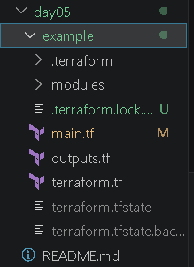

---

### 02. Module Folder Structure

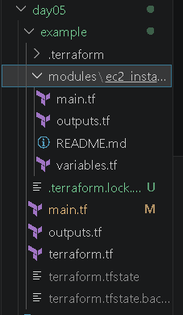

---

### 03. Root Module

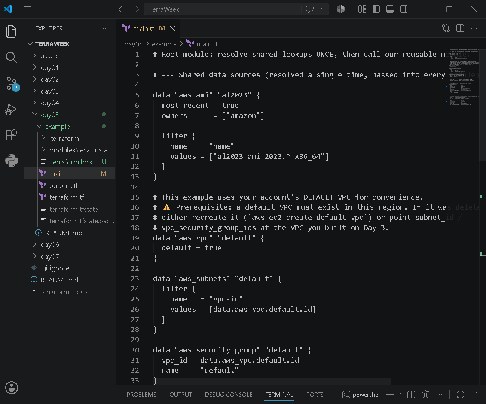

---

### 04. Module Main

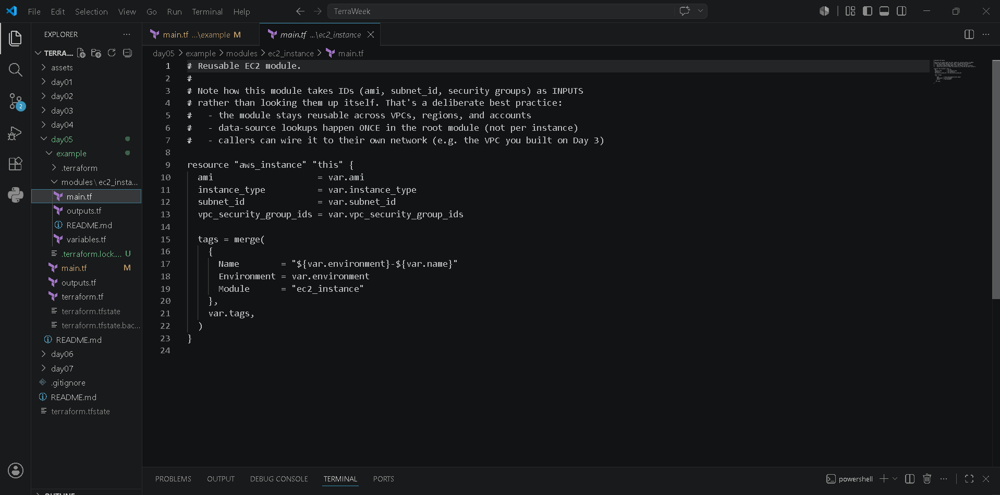

---

### 05. Module Variables

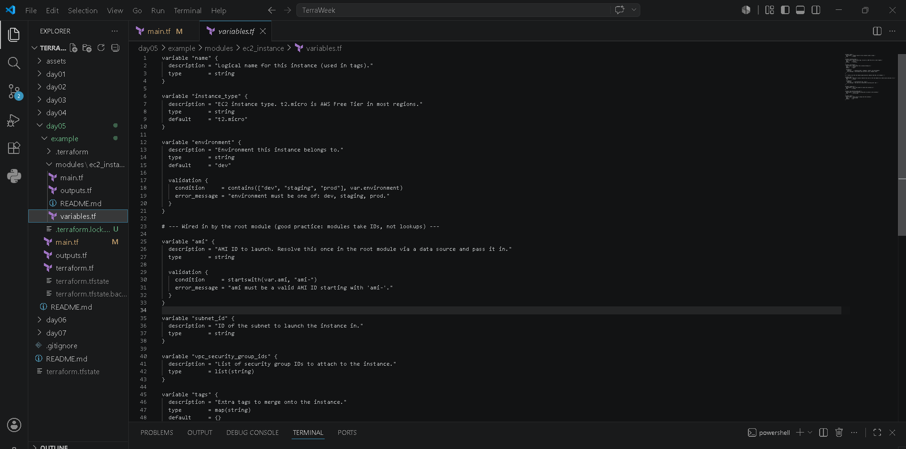

---

### 06. Module Outputs

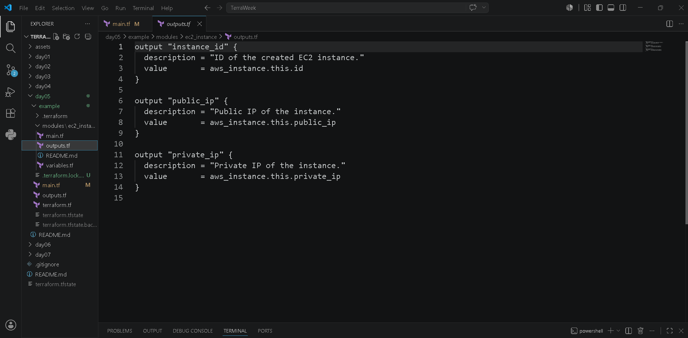

---

## ⚙ Terraform Workflow

### 07. Terraform Init

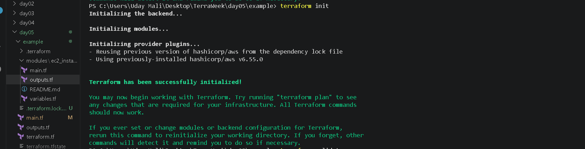

---

### 08. Terraform Validate


---

### 09. Terraform Plan

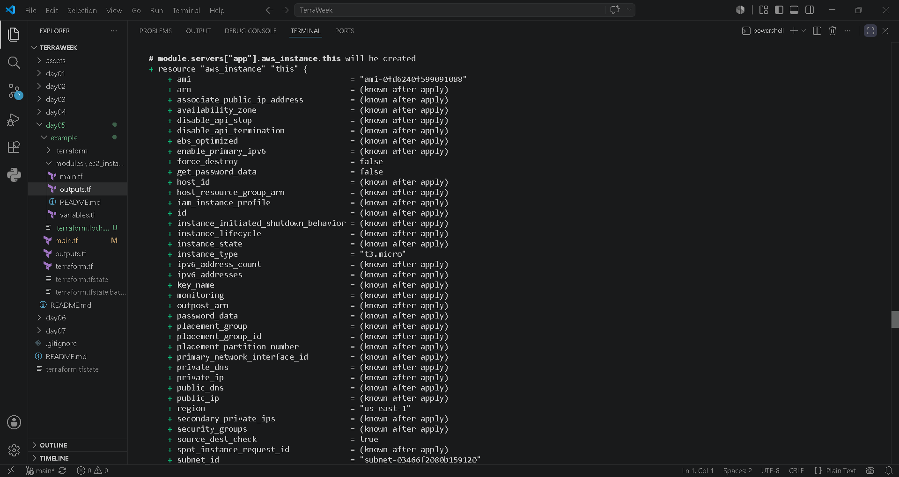

---

### 10. Terraform Apply

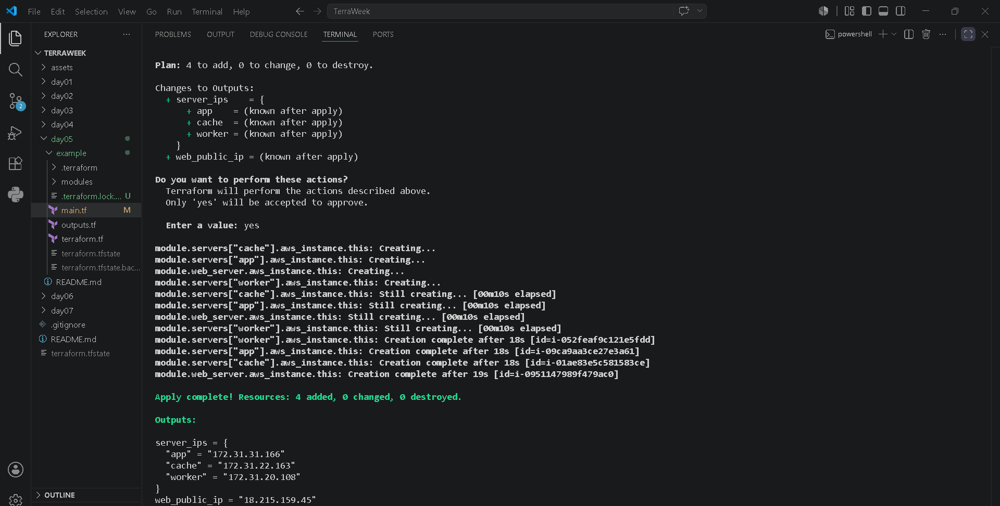

---

### 11. Terraform Output

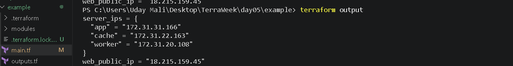

---

### 12. Terraform State List

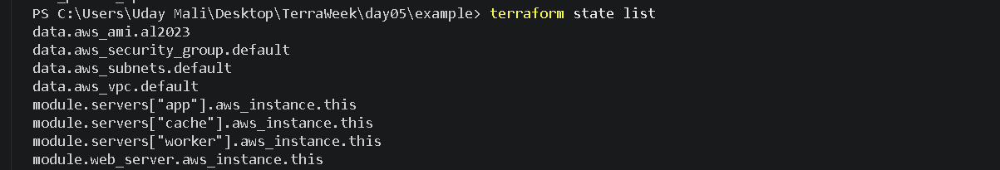

---

### 13. Terraform State Show

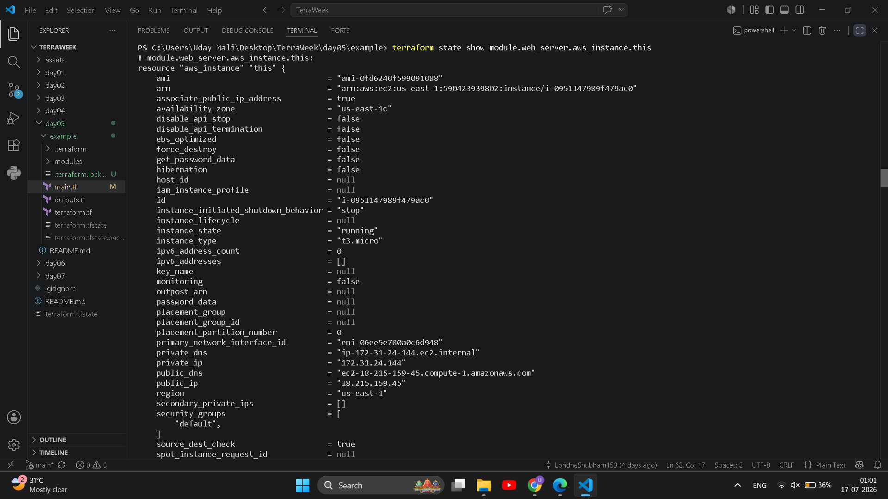

---

## ☁ AWS Console Verification

### 14. EC2 Instances


---

### 15. EC2 Tags

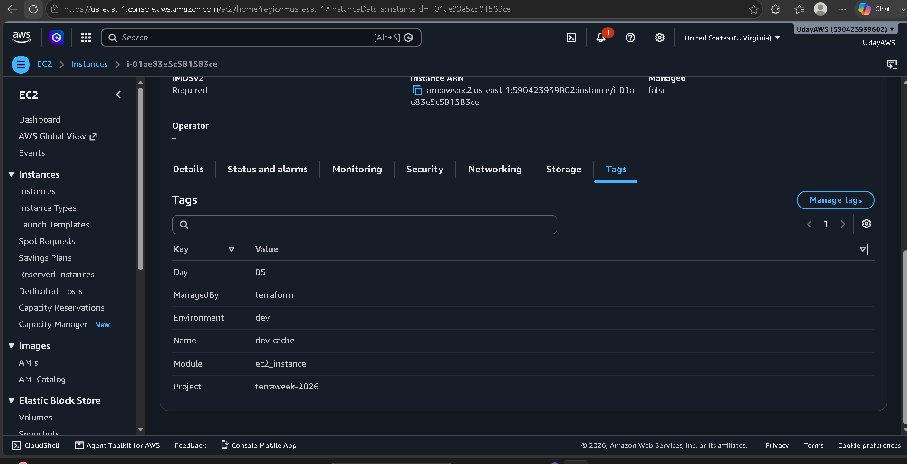

---

### 16. Security Group

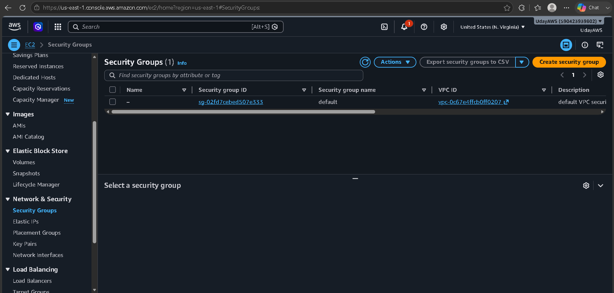

---

### 17. Default VPC

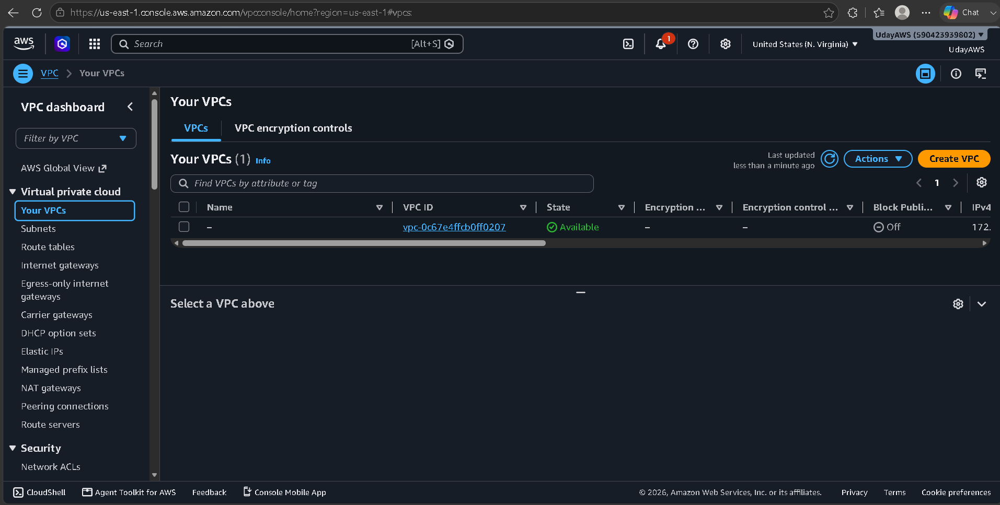

---

### 18. Default Subnets


---

### 19. Module Resources

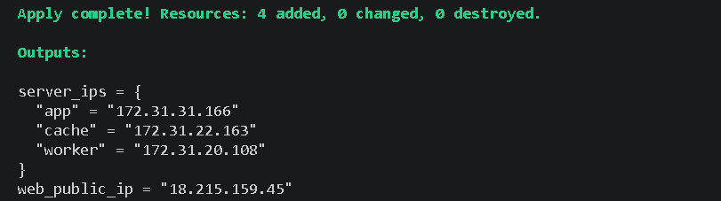

---

### 20. Terraform Destroy

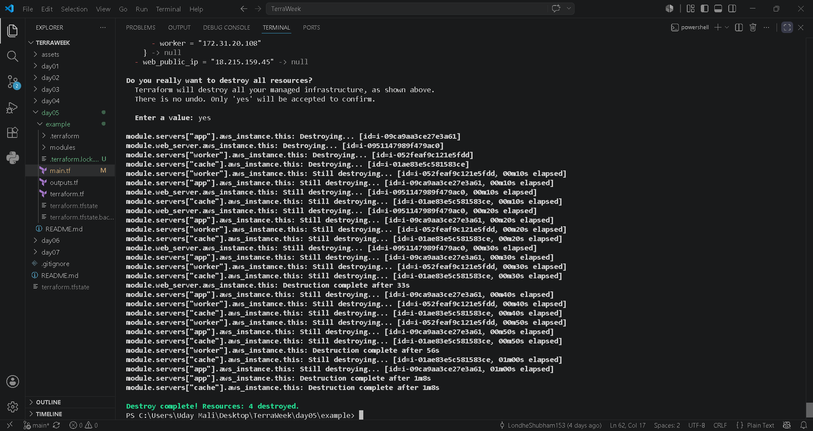

---
---

# 🚧 Challenges Faced

During this lab, I encountered several real-world issues that helped me understand Terraform and AWS more deeply.

## Challenge 1 – Free Tier Instance Type

Initially, Terraform failed to create EC2 instances because the selected instance type was not eligible for my AWS Free Tier account.

### Error

```text
InvalidParameterCombination:
The specified instance type is not eligible for Free Tier.
```

### Resolution

- Updated the instance type as required by my AWS account.
- Revalidated the Terraform configuration.
- Successfully deployed the infrastructure.

---

## Challenge 2 – Missing Default VPC

While running `terraform plan`, Terraform couldn't locate the default VPC.

### Error

```text
Error: no matching EC2 VPC found
```

### Resolution

Created a new Default VPC using AWS CLI.

```bash
aws ec2 create-default-vpc --region us-east-1
```

Terraform was then able to discover the required networking resources.

---

## Challenge 3 – Understanding Module Inputs

Initially, I was confused about why the module accepts AMI IDs, Subnet IDs, and Security Group IDs instead of creating them internally.

After studying the project, I understood that:

- The Root Module performs shared lookups only once.
- Child Modules receive those values as inputs.
- This keeps modules reusable across different environments.

This is considered a Terraform best practice.

---

# 💡 Key Learnings

Through this project, I gained practical experience with:

- Terraform Modules
- Root Module vs Child Module
- Module Inputs & Outputs
- Variable Validation
- Local Modules
- Module Composition
- `for_each`
- Shared Data Sources
- Terraform Registry Modules
- Git Modules
- Version Pinning
- Infrastructure Reusability
- Infrastructure as Code Best Practices

---

# 🛠 Skills Gained

### Terraform

- Modules
- Variables
- Outputs
- Validation
- for_each
- Locals
- Data Sources
- State Management

### AWS

- Amazon EC2
- Amazon VPC
- Default Subnets
- Security Groups

### DevOps

- Infrastructure as Code
- Reusable Infrastructure
- Modular Design
- Version Control
- Automation
- Troubleshooting

---

# ⭐ Best Practices Followed

✅ Modular Infrastructure

✅ Reusable Components

✅ Input Validation

✅ Output Variables

✅ Consistent Resource Tagging

✅ Shared Data Sources

✅ Infrastructure Cleanup

✅ Version Pinning

✅ Documentation

✅ Clean Folder Structure

---

# 📈 Project Outcome

At the end of this lab, I successfully:

- Built a reusable Terraform module
- Created a clean Root Module
- Passed variables through module inputs
- Exported values through outputs
- Used `for_each` to deploy multiple resources
- Understood module composition
- Learned module versioning strategies
- Followed Terraform best practices
- Cleaned up infrastructure using Terraform Destroy

---

# 📚 References

- Terraform Documentation
- Terraform Registry
- AWS Documentation
- TrainWithShubham – TerraWeek Challenge

---

# 👨‍💻 Author

**Uday Mali**

MCA Student | AWS & DevOps Enthusiast

Currently learning:

- AWS Cloud
- Terraform
- Docker
- Linux
- Git & GitHub
- CI/CD
- DevOps

GitHub Repository:

👉 https://github.com/Maliuday/TerraWeek

LinkedIn:

👉 https://www.linkedin.com/in/uday-mali-7aa1b7286/

---

# 🎯 Conclusion

Day 5 was one of the most valuable milestones in my Terraform learning journey.

I moved beyond writing individual Terraform resources and learned how real-world DevOps teams organize infrastructure using reusable modules.

Understanding Root Modules, Child Modules, `for_each`, input validation, outputs, and module versioning gave me a much clearer picture of how scalable Infrastructure as Code is built and maintained.

This project strengthened my confidence in writing clean, reusable, and production-ready Terraform code.

---

<div align="center">

## ⭐ If you found this project helpful, consider giving the repository a Star!

### Thank you for visiting my TerraWeek Journey! 🚀

**Happy Terraforming! 🌍**

</div>
