# 🚀 TerraWeek Day 6 – Advanced Terraform Testing, Workspaces & CI/CD

> **Date:** 17 July 2026

## 📖 Overview

Day 6 was focused on learning **Terraform Testing, Workspaces, Security Scanning, and CI/CD Automation**.

In this hands-on lab, I explored how to improve Terraform quality by using built-in testing, validating infrastructure, scanning Terraform configurations for security issues, and understanding how GitHub Actions can automate Terraform workflows.

This project demonstrates how modern DevOps teams build reliable, secure, and production-ready Infrastructure as Code (IaC).

---

# 🎯 Learning Objectives

During Day 6 I learned how to:

- ✅ Initialize Terraform projects
- ✅ Format Terraform code
- ✅ Validate Terraform configuration
- ✅ Run native Terraform tests
- ✅ Work with Terraform Workspaces
- ✅ Create and switch environments
- ✅ Perform security scanning using Trivy
- ✅ Understand GitHub Actions workflow
- ✅ Follow Infrastructure as Code best practices

---

# 🛠️ Technologies Used

| Technology | Purpose |
|------------|----------|
| Terraform | Infrastructure as Code |
| Terraform Test | Native Terraform Testing |
| Terraform Workspaces | Multiple Environments |
| Trivy | Security Scanner |
| GitHub Actions | CI/CD Pipeline |
| Git | Version Control |
| VS Code | Code Editor |

---

# 📂 Project Structure

```
day06/
│
├── example/
│   ├── tests/
│   │   └── basic.tftest.hcl
│   │
│   ├── .github-workflow-example.yml
│   ├── main.tf
│   ├── terraform.tf
│   └── README.md
│
├── image/
├── day06.md
└── README.md
```

### 📸 Project Folder

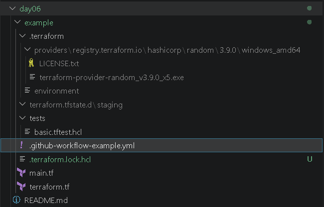

---

# 📄 Main Terraform Configuration

The `main.tf` file contains:

- Variable definitions
- Environment validation
- Local values
- Random resource
- Terraform outputs

### 📸 main.tf

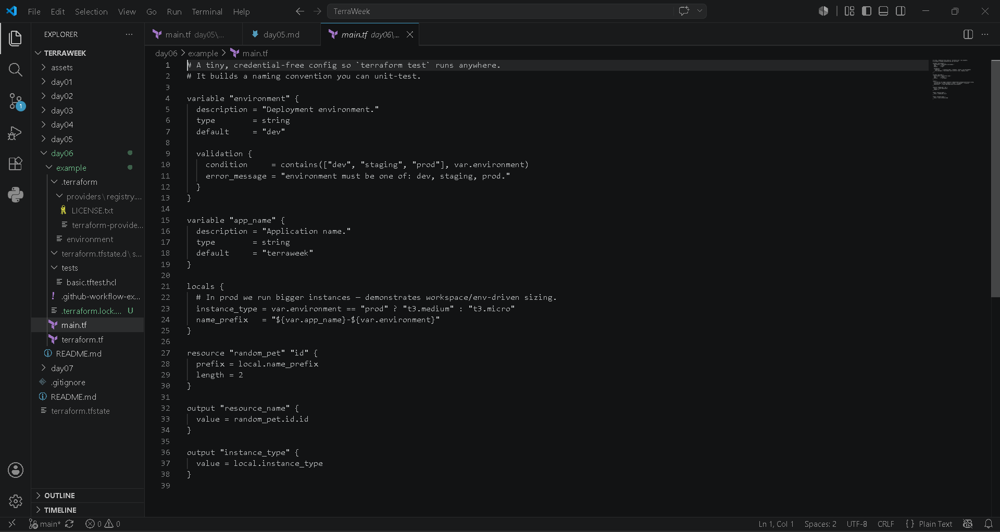

---

# 📄 Terraform Configuration

The `terraform.tf` file defines:

- Required Terraform version
- Required providers
- Provider version constraints

### 📸 terraform.tf

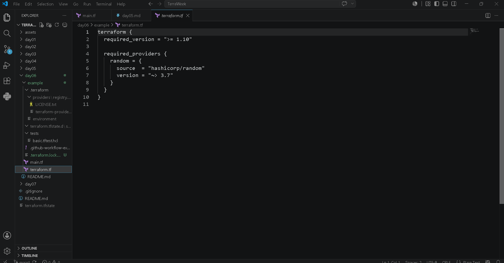

---

# 🧪 Native Terraform Test

Terraform 1.6+ introduces native testing support using `.tftest.hcl`.

The test file verifies:

- Development environment
- Production environment
- Resource naming
- Variable validation

### 📸 Native Test File

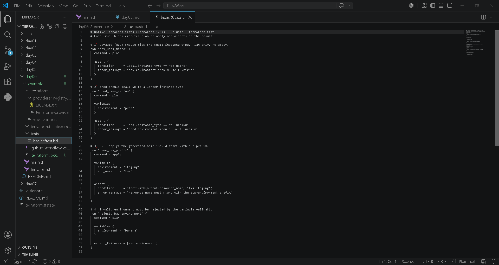

---

# 🤖 GitHub Actions Workflow

A sample GitHub Actions workflow was included to automate:

- Terraform Format
- Terraform Validate
- Terraform Test
- Trivy Security Scan

### 📸 GitHub Workflow

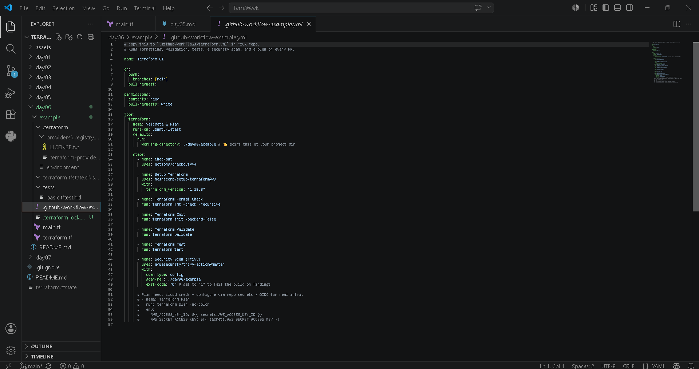

---

# ⚙️ Commands Executed

```bash
terraform init

terraform validate

terraform test

terraform fmt

terraform workspace list

terraform workspace new staging

terraform workspace show

terraform workspace select default

trivy config .
```

---

# 📸 Execution Screenshots

## 1. Terraform Initialization

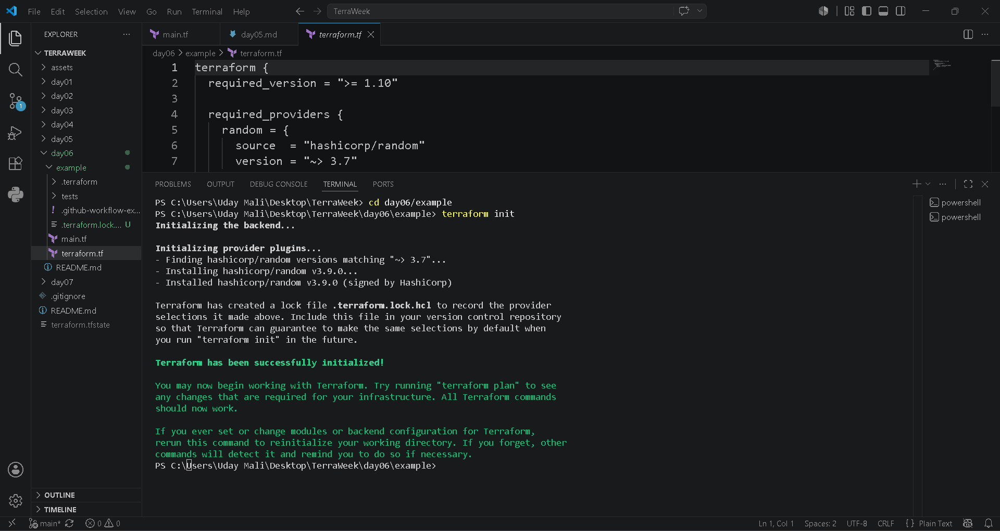

---

## 2. Terraform Validation


---

## 3. Terraform Native Testing

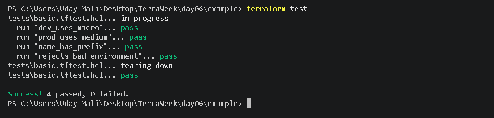

---

## 4. Terraform Formatting


---

# 🌍 Terraform Workspaces

Terraform Workspaces allow us to manage multiple environments using the same Terraform configuration.

Instead of creating separate folders for each environment, Terraform stores separate state files for each workspace.

Common environments include:

- Development (dev)
- Staging (staging)
- Production (prod)

---

## 📋 List Available Workspaces

The following command displays all available workspaces.

```bash
terraform workspace list
```

### 📸 Workspace List

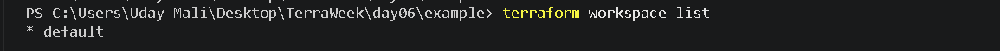

---

## ➕ Create a New Workspace

A new workspace named **staging** was created.

```bash
terraform workspace new staging
```

### 📸 New Workspace

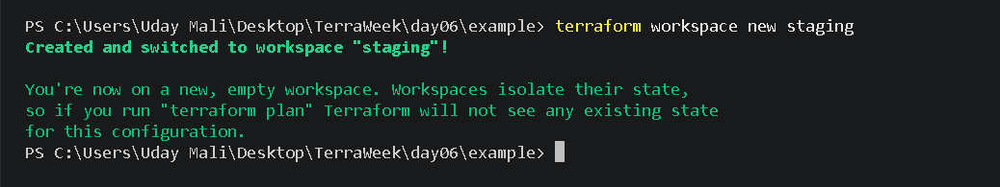

---

## 👀 Show Current Workspace

To verify the active workspace:

```bash
terraform workspace show
```

### 📸 Current Workspace

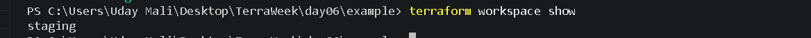

---

## 🔄 Switch Back to Default Workspace

After testing, the workspace was switched back to the default environment.

```bash
terraform workspace select default
```

### 📸 Workspace Select

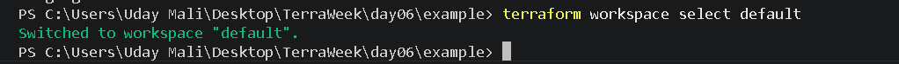

---

# 🔒 Security Scanning with Trivy

Infrastructure security is an important part of DevOps.

Trivy scans Terraform configuration files for:

- Misconfigurations
- Security Risks
- Best Practice Violations
- Infrastructure Weaknesses

Command used:

```bash
trivy config .
```

### 📸 Trivy Security Scan

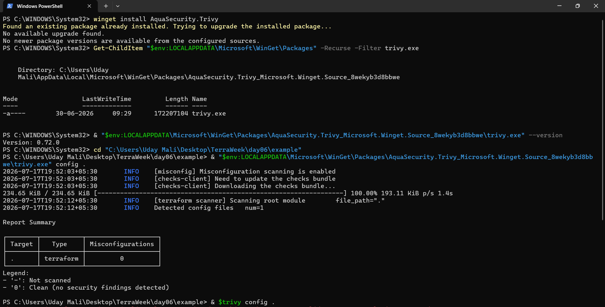

---

## ✅ Scan Result

The scan completed successfully.

Result Summary:

- Terraform Files Scanned
- Misconfigurations Found: **0**
- No Critical Issues
- Infrastructure follows security best practices

---

# 🤖 GitHub Actions CI/CD

GitHub Actions can automatically execute Terraform commands whenever code is pushed to GitHub.

The provided workflow performs:

- Checkout Repository
- Install Terraform
- Terraform Format Check
- Terraform Initialization
- Terraform Validation
- Terraform Testing
- Trivy Security Scan

### 📸 GitHub Workflow Example

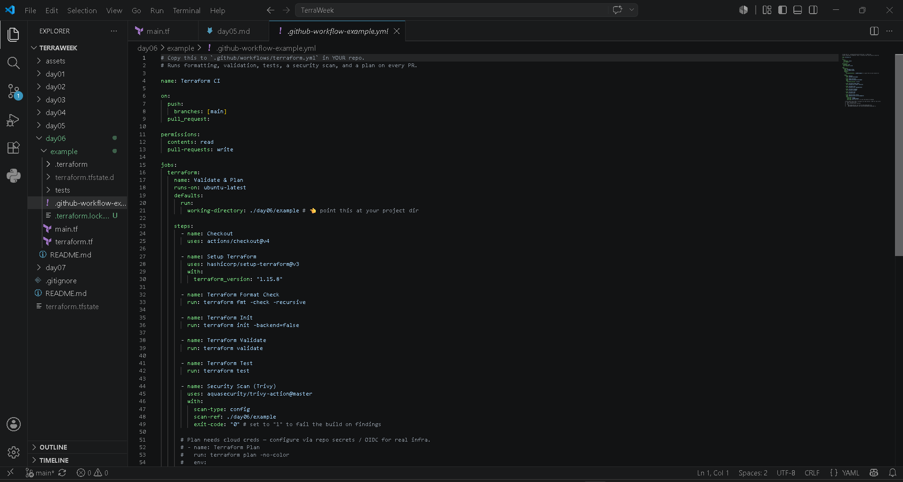

---

# 📚 What I Learned

During Day 6, I learned:

- Native Terraform Testing
- Terraform Workspaces
- Managing Multiple Environments
- Infrastructure Validation
- Code Formatting
- Security Scanning
- GitHub Actions Workflow
- Infrastructure Testing
- DevOps Best Practices
- Production Ready Terraform Workflow

---

# ⭐ Key Takeaways

- Infrastructure should always be validated before deployment.
- Terraform Testing helps catch errors early.
- Workspaces simplify multi-environment deployments.
- Security scanning should be part of every CI/CD pipeline.
- Infrastructure as Code should always be tested before production.
- Automation improves consistency and reliability.

---

# 🎯 Conclusion

Day 6 was focused on improving Terraform quality rather than creating cloud resources.

Instead of provisioning AWS infrastructure, this lab introduced testing, validation, security scanning, and automation practices used by real DevOps teams.

By combining Terraform Testing, Workspaces, Trivy Security Scanning, and GitHub Actions, this project demonstrates how Infrastructure as Code can be developed securely, consistently, and confidently before deployment.

This marks another important milestone in my Terraform and DevOps learning journey.